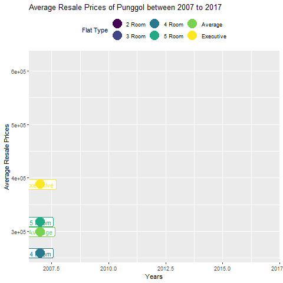
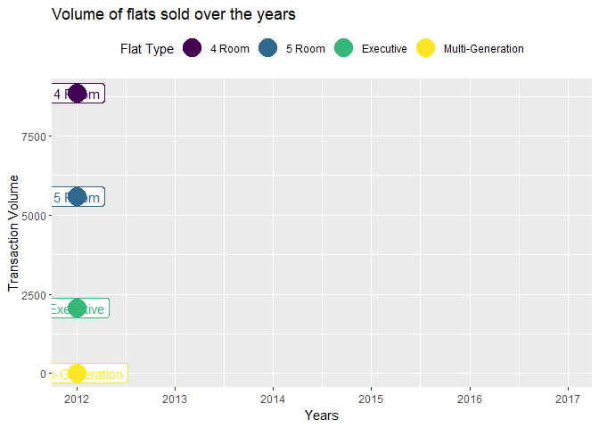

  
```{r libraries, include= FALSE}
library(prettydoc)
library(plyr)
library(dplyr)
library(RColorBrewer)
library(leaflet)
library(geojsonio)
library(ggplot2)
library(gganimate)
library(gifski)
library(data.table)
library(ggrepel)
library(plotly)
library(shiny)
library(rgeos)
library(zoo)
library(htmlwidgets)
library(htmltools)
```


```{r setup, include=FALSE}
knitr::opts_chunk$set(echo = TRUE)
```

***
# Contents

* **Headlines**
  + Forecasting Tengah Town
  + Is $1m HDB becoming the norm?
  + Predicting **YOUR MUM**
  
<br>

* **Visualizations**
  + Remaking Our Heartland 
  + Relationship Between POI and Resale Price
  + Why Prices Drastically Increase From 2007 Onwards 
  + Value Comparison Between Mature Towns And Non-Mature Towns
  + Does Premium/Non-standard HDBs account for high resale value? 
  + Compare HDB Median Resale Price Per Town
 
***

## Headlines

Lorem ipsum dolor sit amet, consectetur adipiscing elit, sed do eiusmod tempor incididunt ut labore et dolore magna aliqua. Ut enim ad minim veniam, quis nostrud exercitation ullamco laboris nisi ut aliquip ex ea commodo consequat. Duis aute irure dolor in reprehenderit in voluptate velit esse cillum dolore eu fugiat nulla pariatur. Excepteur sint occaecat cupidatat non proident, sunt in culpa qui officia deserunt mollit anim id est laborum.

&nbsp;
&nbsp;

## Headline 1

``` {r H1G1 Code, echo=FALSE, include=FALSE}

Punggol <- read.csv("./Datasets/HDB Resale Prices.csv")
Punggol$month <- as.Date(paste0(Punggol$month, "-01"), "%Y-%m-%d")
Punggol$year <- format(as.Date(Punggol$month, format="%Y-%m-%d"),"%Y")
Punggol2 <- filter(Punggol, month >= "2007-01-01",town == "PUNGGOL")

type22007<-filter(Punggol2, Punggol2$flat_type=="2 ROOM", Punggol2$year=="2007")
type22008<-filter(Punggol2, Punggol2$flat_type=="2 ROOM", Punggol2$year=="2008")
type22009<-filter(Punggol2, Punggol2$flat_type=="2 ROOM", Punggol2$year=="2009")
type22010<-filter(Punggol2, Punggol2$flat_type=="2 ROOM", Punggol2$year=="2010")
type22011<-filter(Punggol2, Punggol2$flat_type=="2 ROOM", Punggol2$year=="2011")
type22012<-filter(Punggol2, Punggol2$flat_type=="2 ROOM", Punggol2$year=="2012")
type22013<-filter(Punggol2, Punggol2$flat_type=="2 ROOM", Punggol2$year=="2013")
type22014<-filter(Punggol2, Punggol2$flat_type=="2 ROOM", Punggol2$year=="2014")
type22015<-filter(Punggol2, Punggol2$flat_type=="2 ROOM", Punggol2$year=="2015")
type22016<-filter(Punggol2, Punggol2$flat_type=="2 ROOM", Punggol2$year=="2016")
type22017<-filter(Punggol2, Punggol2$flat_type=="2 ROOM", Punggol2$year=="2017")

a2007<-as.integer(mean(type22007$resale_price))
a2008<-as.integer(mean(type22008$resale_price))
a2009<-as.integer(mean(type22009$resale_price))
a2010<-as.integer(mean(type22010$resale_price))
a2011<-as.integer(mean(type22011$resale_price))
a2012<-as.integer(mean(type22012$resale_price))
a2013<-as.integer(mean(type22013$resale_price))
a2014<-as.integer(mean(type22014$resale_price))
a2015<-as.integer(mean(type22015$resale_price))
a2016<-as.integer(mean(type22016$resale_price))
a2017<-as.integer(mean(type22017$resale_price))

type32007<-filter(Punggol2, Punggol2$flat_type=="3 ROOM", Punggol2$year == "2007")
type32008<-filter(Punggol2, Punggol2$flat_type=="3 ROOM", Punggol2$year == "2008")
type32009<-filter(Punggol2, Punggol2$flat_type=="3 ROOM", Punggol2$year == "2009")
type32010<-filter(Punggol2, Punggol2$flat_type=="3 ROOM", Punggol2$year == "2010")
type32011<-filter(Punggol2, Punggol2$flat_type=="3 ROOM", Punggol2$year == "2011")
type32012<-filter(Punggol2, Punggol2$flat_type=="3 ROOM", Punggol2$year == "2012")
type32013<-filter(Punggol2, Punggol2$flat_type=="3 ROOM", Punggol2$year == "2013")
type32014<-filter(Punggol2, Punggol2$flat_type=="3 ROOM", Punggol2$year == "2014")
type32015<-filter(Punggol2, Punggol2$flat_type=="3 ROOM", Punggol2$year == "2015")
type32016<-filter(Punggol2, Punggol2$flat_type=="3 ROOM", Punggol2$year == "2016")
type32017<-filter(Punggol2, Punggol2$flat_type=="3 ROOM", Punggol2$year == "2017")

b2007<-as.integer(mean(type32007$resale_price))
b2008<-as.integer(mean(type32008$resale_price))
b2009<-as.integer(mean(type32009$resale_price))
b2010<-as.integer(mean(type32010$resale_price))
b2011<-as.integer(mean(type32011$resale_price))
b2012<-as.integer(mean(type32012$resale_price))
b2013<-as.integer(mean(type32013$resale_price))
b2014<-as.integer(mean(type32014$resale_price))
b2015<-as.integer(mean(type32015$resale_price))
b2016<-as.integer(mean(type32016$resale_price))
b2017<-as.integer(mean(type32017$resale_price))

type42007<-filter(Punggol2, Punggol2$flat_type=="4 ROOM", Punggol2$year=="2007")
type42008<-filter(Punggol2, Punggol2$flat_type=="4 ROOM", Punggol2$year=="2008")
type42009<-filter(Punggol2, Punggol2$flat_type=="4 ROOM", Punggol2$year=="2009")
type42010<-filter(Punggol2, Punggol2$flat_type=="4 ROOM", Punggol2$year=="2010")
type42011<-filter(Punggol2, Punggol2$flat_type=="4 ROOM", Punggol2$year=="2011")
type42012<-filter(Punggol2, Punggol2$flat_type=="4 ROOM", Punggol2$year=="2012")
type42013<-filter(Punggol2, Punggol2$flat_type=="4 ROOM", Punggol2$year=="2013")
type42014<-filter(Punggol2, Punggol2$flat_type=="4 ROOM", Punggol2$year=="2014")
type42015<-filter(Punggol2, Punggol2$flat_type=="4 ROOM", Punggol2$year=="2015")
type42016<-filter(Punggol2, Punggol2$flat_type=="4 ROOM", Punggol2$year=="2016")
type42017<-filter(Punggol2, Punggol2$flat_type=="4 ROOM", Punggol2$year=="2017")

c2007<-as.integer(mean(type42007$resale_price))
c2008<-as.integer(mean(type42008$resale_price))
c2009<-as.integer(mean(type42009$resale_price))
c2010<-as.integer(mean(type42010$resale_price))
c2011<-as.integer(mean(type42011$resale_price))
c2012<-as.integer(mean(type42012$resale_price))
c2013<-as.integer(mean(type42013$resale_price))
c2014<-as.integer(mean(type42014$resale_price))
c2015<-as.integer(mean(type42015$resale_price))
c2016<-as.integer(mean(type42016$resale_price))
c2017<-as.integer(mean(type42017$resale_price))

type52007<-filter(Punggol2, Punggol2$flat_type=="5 ROOM", Punggol2$year == "2007")
type52008<-filter(Punggol2, Punggol2$flat_type=="5 ROOM", Punggol2$year == "2008")
type52009<-filter(Punggol2, Punggol2$flat_type=="5 ROOM", Punggol2$year == "2009")
type52010<-filter(Punggol2, Punggol2$flat_type=="5 ROOM", Punggol2$year == "2010")
type52011<-filter(Punggol2, Punggol2$flat_type=="5 ROOM", Punggol2$year == "2011")
type52012<-filter(Punggol2, Punggol2$flat_type=="5 ROOM", Punggol2$year == "2012")
type52013<-filter(Punggol2, Punggol2$flat_type=="5 ROOM", Punggol2$year == "2013")
type52014<-filter(Punggol2, Punggol2$flat_type=="5 ROOM", Punggol2$year == "2014")
type52015<-filter(Punggol2, Punggol2$flat_type=="5 ROOM", Punggol2$year == "2015")
type52016<-filter(Punggol2, Punggol2$flat_type=="5 ROOM", Punggol2$year == "2016")
type52017<-filter(Punggol2, Punggol2$flat_type=="5 ROOM", Punggol2$year == "2017")

d2007<-as.integer(mean(type52007$resale_price))
d2008<-as.integer(mean(type52008$resale_price))
d2009<-as.integer(mean(type52009$resale_price))
d2010<-as.integer(mean(type52010$resale_price))
d2011<-as.integer(mean(type52011$resale_price))
d2012<-as.integer(mean(type52012$resale_price))
d2013<-as.integer(mean(type52013$resale_price))
d2014<-as.integer(mean(type52014$resale_price))
d2015<-as.integer(mean(type52015$resale_price))
d2016<-as.integer(mean(type52016$resale_price))
d2017<-as.integer(mean(type52017$resale_price))

type62007<-filter(Punggol2, Punggol2$flat_type=="EXECUTIVE", Punggol2$year == "2007")
type62008<-filter(Punggol2, Punggol2$flat_type=="EXECUTIVE", Punggol2$year == "2008")
type62009<-filter(Punggol2, Punggol2$flat_type=="EXECUTIVE", Punggol2$year == "2009")
type62010<-filter(Punggol2, Punggol2$flat_type=="EXECUTIVE", Punggol2$year == "2010")
type62011<-filter(Punggol2, Punggol2$flat_type=="EXECUTIVE", Punggol2$year == "2011")
type62012<-filter(Punggol2, Punggol2$flat_type=="EXECUTIVE", Punggol2$year == "2012")
type62013<-filter(Punggol2, Punggol2$flat_type=="EXECUTIVE", Punggol2$year == "2013")
type62014<-filter(Punggol2, Punggol2$flat_type=="EXECUTIVE", Punggol2$year == "2014")
type62015<-filter(Punggol2, Punggol2$flat_type=="EXECUTIVE", Punggol2$year == "2015")
type62016<-filter(Punggol2, Punggol2$flat_type=="EXECUTIVE", Punggol2$year == "2016")
type62017<-filter(Punggol2, Punggol2$flat_type=="EXECUTIVE", Punggol2$year == "2017")

e2007<-as.integer(mean(type62007$resale_price))
e2008<-as.integer(mean(type62008$resale_price))
e2009<-as.integer(mean(type62009$resale_price))
e2010<-as.integer(mean(type62010$resale_price))
e2011<-as.integer(mean(type62011$resale_price))
e2012<-as.integer(mean(type62012$resale_price))
e2013<-as.integer(mean(type62013$resale_price))
e2014<-as.integer(mean(type62014$resale_price))
e2015<-as.integer(mean(type62015$resale_price))
e2016<-as.integer(mean(type62016$resale_price))
e2017<-as.integer(mean(type62017$resale_price))

type4and52007<-filter(Punggol2, Punggol2$year=="2007"| Punggol2$flat_type=="4 ROOM"& Punggol2$flat_type=="5 ROOM")
type4and52008<-filter(Punggol2, Punggol2$year=="2008"| Punggol2$flat_type=="4 ROOM"& Punggol2$flat_type=="5 ROOM")
type4and52009<-filter(Punggol2, Punggol2$year=="2009"| Punggol2$flat_type=="4 ROOM"& Punggol2$flat_type=="5 ROOM")
type4and52010<-filter(Punggol2, Punggol2$year=="2010"| Punggol2$flat_type=="4 ROOM"& Punggol2$flat_type=="5 ROOM")
type4and52011<-filter(Punggol2, Punggol2$year=="2011"| Punggol2$flat_type=="4 ROOM"& Punggol2$flat_type=="5 ROOM")
type4and52012<-filter(Punggol2, Punggol2$year=="2012"| Punggol2$flat_type=="4 ROOM"& Punggol2$flat_type=="5 ROOM")
type4and52013<-filter(Punggol2, Punggol2$year=="2013"| Punggol2$flat_type=="4 ROOM"& Punggol2$flat_type=="5 ROOM")
type4and52014<-filter(Punggol2, Punggol2$year=="2014"| Punggol2$flat_type=="4 ROOM"& Punggol2$flat_type=="5 ROOM")
type23452015<-filter(Punggol2, Punggol2$year=="2015"| Punggol2$flat_type=="2 ROOM"& Punggol2$flat_type=="3 ROOM"&Punggol2$flat_type=="4 ROOM"& Punggol2$flat_type=="5 ROOM")
type23452016<-filter(Punggol2, Punggol2$year=="2016"| Punggol2$flat_type=="2 ROOM"& Punggol2$flat_type=="3 ROOM"&Punggol2$flat_type=="4 ROOM"& Punggol2$flat_type=="5 ROOM")
type23452017<-filter(Punggol2, Punggol2$year=="2017"| Punggol2$flat_type=="2 ROOM"& Punggol2$flat_type=="3 ROOM"&Punggol2$flat_type=="4 ROOM"& Punggol2$flat_type=="5 ROOM")

f2007<-as.integer(mean(type4and52007$resale_price))
f2008<-as.integer(mean(type4and52008$resale_price))
f2009<-as.integer(mean(type4and52009$resale_price))
f2010<-as.integer(mean(type4and52010$resale_price))
f2011<-as.integer(mean(type4and52011$resale_price))
f2012<-as.integer(mean(type4and52012$resale_price))
f2013<-as.integer(mean(type4and52013$resale_price))
f2014<-as.integer(mean(type4and52014$resale_price))
f2015<-as.integer(mean(type23452015$resale_price))
f2016<-as.integer(mean(type23452016$resale_price))
f2017<-as.integer(mean(type23452017$resale_price))

Year <- c("2007","2008","2009","2010","2011","2012","2013","2014","2015","2016","2017")

tworoom <- c(a2007,a2008,a2009,a2010,a2011,a2012,a2013,a2014,a2015,a2016,a2017)
threeroom <- c(b2007,b2008,b2009,b2010,b2011,b2012,b2013,b2014,b2015,b2016,b2017)
fourroom <- c(c2007,c2008,c2009,c2010,c2011,c2012,c2013,c2014,c2015,c2016,c2017)
fiveroom <- c(d2007,d2008,d2009,d2010,d2011,d2012,d2013,d2014,d2015,d2016,d2017)
executive <- c(e2007,e2008,e2009,e2010,e2011,e2012,e2013,e2014,e2015,e2016,e2017)
average <- c(f2007,f2008,f2009,f2010,f2011,f2012,f2013,f2014,f2015,f2016,f2017)

Punggoldf <- data.frame(Year,tworoom,threeroom,fourroom,fiveroom,executive,average)

is.nan.data.frame <- function(x)
  do.call(cbind, lapply(x, is.nan))

Punggoldf[is.nan(Punggoldf)] <- 0
```

```{r H1G1, message = FALSE, warning = FALSE, echo=FALSE }

plot_ly(
  type = 'table',
  header = list(
    values = c('<b>YEAR</b>', '<b>2 Room</b>','<b>3 Room</b>','<b>4 Room</b>','<b>5 Room</b>','<b>Executive<b>','<b>Total<b>'),
    line = list(color = '#506784'),
    fill = list(color = 'red'),
    align = c('left','center'),
    font = list(color = 'black', size = 12)
  ),
  cells = list(
    values = rbind(
      c("2007","2008","2009","2010","2011","2012","2013","2014","2015","2016","2017", '<b>2008 vs 2018</b>'),
      c(a2007,a2008,a2009,a2010,a2011,a2012,a2013,a2014,a2015,a2016,a2017,"null"),
      c(b2007,b2008,b2009,b2010,b2011,b2012,b2013,b2014,b2015,b2016,b2017,"null"),
      c(c2007,c2008,c2009,c2010,c2011,c2012,c2013,c2014,c2015,c2016,c2017,"71.4%"),
      c(d2007,d2008,d2009,d2010,d2011,d2012,d2013,d2014,d2015,d2016,d2017,"48.2%"),
      c(e2007,e2008,e2009,e2010,e2011,e2012,e2013,e2014,e2015,e2016,e2017,"41.6%"),
      c(f2007,f2008,f2009,f2010,f2011,f2012,f2013,f2014,f2015,f2016,f2017,"50.5%")),
    line = list(color = '#506784'),
    fill = list(color = c('red', 'white')),
    align = c('left', 'center'),
    font = list(color = c('black'), size = 12)
  ))
```
Lorem ipsum dolor sit amet, consectetur adipiscing elit, sed do eiusmod tempor incididunt ut labore et dolore magna aliqua. Ut enim ad minim veniam, quis nostrud exercitation ullamco laboris nisi ut aliquip ex ea commodo consequat. Duis aute irure dolor in reprehenderit in voluptate velit esse cillum dolore eu fugiat nulla pariatur. Excepteur sint occaecat cupidatat non proident, sunt in culpa qui officia deserunt mollit anim id est laborum.

```{r H1G2 Code, message = FALSE, warning = FALSE, results = FALSE,echo=FALSE}

Price <- c(a2007,a2008,a2009,a2010,a2011,a2012,a2013,a2014,a2015,a2016,a2017,
           b2007,b2008,b2009,b2010,b2011,b2012,b2013,b2014,b2015,b2016,b2017,
           c2007,c2008,c2009,c2010,c2011,c2012,c2013,c2014,c2015,c2016,c2017,
           d2007,d2008,d2009,d2010,d2011,d2012,d2013,d2014,d2015,d2016,d2017,
           e2007,e2008,e2009,e2010,e2011,e2012,e2013,e2014,e2015,e2016,e2017,
           f2007,f2008,f2009,f2010,f2011,f2012,f2013,f2014,f2015,f2016,f2017)

Years <- c("2007","2008","2009","2010","2011","2012","2013","2014","2015","2016","2017",
           "2007","2008","2009","2010","2011","2012","2013","2014","2015","2016","2017",
           "2007","2008","2009","2010","2011","2012","2013","2014","2015","2016","2017",
           "2007","2008","2009","2010","2011","2012","2013","2014","2015","2016","2017",
           "2007","2008","2009","2010","2011","2012","2013","2014","2015","2016","2017",
           "2007","2008","2009","2010","2011","2012","2013","2014","2015","2016","2017")

Flat_Type <- c("2 Room","2 Room","2 Room","2 Room","2 Room","2 Room","2 Room","2 Room","2 Room","2 Room","2 Room",
               "3 Room","3 Room","3 Room","3 Room","3 Room","3 Room","3 Room","3 Room","3 Room","3 Room","3 Room",
               "4 Room","4 Room","4 Room","4 Room","4 Room","4 Room","4 Room","4 Room","4 Room","4 Room","4 Room",
               "5 Room","5 Room","5 Room","5 Room","5 Room","5 Room","5 Room","5 Room","5 Room","5 Room","5 Room",
               "Executive","Executive","Executive","Executive","Executive","Executive","Executive","Executive","Executive","Executive","Executive",
               "Average","Average","Average","Average","Average","Average","Average","Average","Average","Average","Average")

kgif <- data.frame(Price,Years,Flat_Type)
kgif$Price <- as.numeric(as.character(kgif$Price))
kgif$Years <- as.numeric(as.character(kgif$Years))

```

```{r H1G2, message = FALSE, warning = FALSE, results = FALSE, echo=FALSE}
k <- ggplot(
  kgif,
  aes(Years,Price, group = Flat_Type, color = factor(Flat_Type), label = Flat_Type)
) +
  geom_line() +
  scale_color_viridis_d() +
  labs(x = "Years", y = "Yceffc") +
  ggtitle("TITLE") +
  theme(legend.position = "top") +
  guides(color=guide_legend(title="Flat Type")) +
  geom_label() +
  geom_point(aes(group = seq_along(Years)), size = 7) +
  transition_reveal(Years)

anim_save("k.gif", k)
```


Lorem ipsum dolor sit amet, consectetur adipiscing elit, sed do eiusmod tempor incididunt ut labore et dolore magna aliqua. Ut enim ad minim veniam, quis nostrud exercitation ullamco laboris nisi ut aliquip ex ea commodo consequat. Duis aute irure dolor in reprehenderit in voluptate velit esse cillum dolore eu fugiat nulla pariatur. Excepteur sint occaecat cupidatat non proident, sunt in culpa qui officia deserunt mollit anim id est laborum.


## Headline 2

```{r H2G1 Code, echo=FALSE, include=FALSE}

hdb2 <- read.csv("./Datasets/HDB Resale Prices.csv")

hdb2$month <- as.Date(paste0(hdb2$month, "-01"), "%Y-%m-%d")

hdb3 <- filter(hdb2, month >= "2012-01-01")

hdb4 <- filter(hdb3, flat_type == "4 ROOM" | 
                     flat_type == "5 ROOM" | 
                     flat_type == "EXECUTIVE" | 
                     flat_type == "MULTI-GENERATION")

hdb5 <- filter(hdb4, resale_price >= 900000)

hdb6 <- count(hdb5, "flat_type")

hdb7 <- data.frame(hdb5$flat_type, hdb5$resale_price, hdb5$month)

hdb7$hdb5.resale_price <- 1

sum(hdb7$hdb5.resale_price)
```

```{r H2G1, echo=FALSE}
setDT(hdb7)[,hdb5.month := as.IDate(hdb5.month)]
ggplot(hdb7[,sum(hdb5.resale_price), by=.(hdb5.flat_type, year(hdb5.month))], aes(x=year, y=V1, fill=hdb5.flat_type)) +
  geom_bar(stat = "identity") +
  geom_label_repel(aes(label=V1), vjust=0) +
  ggtitle("Resale flats above $900K by Year") +
  xlab("Year") + ylab("Transaction Volume") +
  labs(fill='Flat Type') 
```

Lorem ipsum dolor sit amet, consectetur adipiscing elit, sed do eiusmod tempor incididunt ut labore et dolore magna aliqua. Ut enim ad minim veniam, quis nostrud exercitation ullamco laboris nisi ut aliquip ex ea commodo consequat. Duis aute irure dolor in reprehenderit in voluptate velit esse cillum dolore eu fugiat nulla pariatur. Excepteur sint occaecat cupidatat non proident, sunt in culpa qui officia deserunt mollit anim id est laborum.

```{r H2G2 code, message = FALSE, warning = FALSE, results = FALSE,echo=FALSE}
hdb8 <- filter(hdb3, flat_type == "4 ROOM" | 
                 flat_type == "5 ROOM" | 
                 flat_type == "EXECUTIVE" | 
                 flat_type == "MULTI-GENERATION")

hdb9 <- data.frame(hdb8$flat_type, hdb8$month)

hdb9$year <- substring(hdb9$hdb8.month,1,4)

i <- sapply(hdb9, is.factor)
hdb9[i] <- lapply(hdb9[i], as.character)

hdb9$year <- as.numeric(as.character(hdb9$year))

hdb4R2012 <- nrow(subset(hdb9,hdb8.flat_type == '4 ROOM' & hdb9$year=='2012'))
hdb5R2012 <- nrow(subset(hdb9,hdb8.flat_type == '5 ROOM' & hdb9$year=='2012'))
hdbEX2012 <- nrow(subset(hdb9,hdb8.flat_type == 'EXECUTIVE' & hdb9$year=='2012'))
hdbMG2012 <- nrow(subset(hdb9,hdb8.flat_type == 'MULTI-GENERATION' & hdb9$year=='2012'))

hdb4R2013 <- nrow(subset(hdb9,hdb8.flat_type == '4 ROOM' & hdb9$year=='2013'))
hdb5R2013 <- nrow(subset(hdb9,hdb8.flat_type == '5 ROOM' & hdb9$year=='2013'))
hdbEX2013 <- nrow(subset(hdb9,hdb8.flat_type == 'EXECUTIVE' & hdb9$year=='2013'))
hdbMG2013 <- nrow(subset(hdb9,hdb8.flat_type == 'MULTI-GENERATION' & hdb9$year=='2013'))

hdb4R2014 <- nrow(subset(hdb9,hdb8.flat_type == '4 ROOM' & hdb9$year=='2014'))
hdb5R2014 <- nrow(subset(hdb9,hdb8.flat_type == '5 ROOM' & hdb9$year=='2014'))
hdbEX2014 <- nrow(subset(hdb9,hdb8.flat_type == 'EXECUTIVE' & hdb9$year=='2014'))
hdbMG2014 <- nrow(subset(hdb9,hdb8.flat_type == 'MULTI-GENERATION' & hdb9$year=='2014'))

hdb4R2015 <- nrow(subset(hdb9,hdb8.flat_type == '4 ROOM' & hdb9$year=='2015'))
hdb5R2015 <- nrow(subset(hdb9,hdb8.flat_type == '5 ROOM' & hdb9$year=='2015'))
hdbEX2015 <- nrow(subset(hdb9,hdb8.flat_type == 'EXECUTIVE' & hdb9$year=='2015'))
hdbMG2015 <- nrow(subset(hdb9,hdb8.flat_type == 'MULTI-GENERATION' & hdb9$year=='2015'))

hdb4R2016 <- nrow(subset(hdb9,hdb8.flat_type == '4 ROOM' & hdb9$year=='2016'))
hdb5R2016 <- nrow(subset(hdb9,hdb8.flat_type == '5 ROOM' & hdb9$year=='2016'))
hdbEX2016 <- nrow(subset(hdb9,hdb8.flat_type == 'EXECUTIVE' & hdb9$year=='2016'))
hdbMG2016 <- nrow(subset(hdb9,hdb8.flat_type == 'MULTI-GENERATION' & hdb9$year=='2016'))

hdb4R2017 <- nrow(subset(hdb9,hdb8.flat_type == '4 ROOM' & hdb9$year=='2017'))
hdb5R2017 <- nrow(subset(hdb9,hdb8.flat_type == '5 ROOM' & hdb9$year=='2017'))
hdbEX2017 <- nrow(subset(hdb9,hdb8.flat_type == 'EXECUTIVE' & hdb9$year=='2017'))
hdbMG2017 <- nrow(subset(hdb9,hdb8.flat_type == 'MULTI-GENERATION' & hdb9$year=='2017'))

Volume <- c(hdb4R2012,hdb4R2013,hdb4R2014,hdb4R2015,hdb4R2016,hdb4R2017,
            hdb5R2012,hdb5R2013,hdb5R2014,hdb5R2015,hdb5R2016,hdb5R2017,
            hdbEX2012,hdbEX2013,hdbEX2014,hdbEX2015,hdbEX2016,hdbEX2017,
            hdbMG2012,hdbMG2013,hdbMG2014,hdbMG2015,hdbMG2016,hdbMG2017)


Flat_Type <- c("4 Room","4 Room","4 Room","4 Room","4 Room","4 Room",
               "5 Room","5 Room","5 Room","5 Room","5 Room","5 Room",
               "Executive","Executive","Executive","Executive","Executive","Executive",
               "Multi-Generation","Multi-Generation","Multi-Generation","Multi-Generation","Multi-Generation","Multi-Generation")

Year <- c("2012","2013","2014","2015","2016","2017",
          "2012","2013","2014","2015","2016","2017",
          "2012","2013","2014","2015","2016","2017",
          "2012","2013","2014","2015","2016","2017")


finalhdb <- data.frame(Volume,Year,Flat_Type)

finalhdb$Year <- as.numeric(as.character(finalhdb$Year))
```

```{r H2G2, message = FALSE, warning = FALSE, results = FALSE, echo=FALSE}
p <- ggplot(
  finalhdb,
  aes(Year,Volume, group = Flat_Type, color = factor(Flat_Type), label = Flat_Type)
) +
  geom_line() +
  scale_color_viridis_d() +
  labs(x = "Years", y = "Transaction Volume") +
  ggtitle("Volume of flats sold over the years") +
  theme(legend.position = "top") +
  guides(color=guide_legend(title="Flat Type")) +
  geom_label() +
  geom_point(aes(group = seq_along(Year)), size = 7) +
  transition_reveal(Year)

anim_save("p.gif", p)

```


Lorem ipsum dolor sit amet, consectetur adipiscing elit, sed do eiusmod tempor incididunt ut labore et dolore magna aliqua. Ut enim ad minim veniam, quis nostrud exercitation ullamco laboris nisi ut aliquip ex ea commodo consequat. Duis aute irure dolor in reprehenderit in voluptate velit esse cillum dolore eu fugiat nulla pariatur. Excepteur sint occaecat cupidatat non proident, sunt in culpa qui officia deserunt mollit anim id est laborum.

## Predictive Model

Still trying to make it work...

## Visualization 1

```{r V1G1 Code, echo=FALSE, include=FALSE}

#Headline 1: Remaking our Heartland

raw1<-read.csv("./Datasets/HDB Resale Prices.csv")

#regroup data to year
year<-substr(raw1$month, start = 1, stop = 4)
df<-as.data.frame(year)
raw<-cbind(df,raw1)

#select towns with ROH
library(dplyr)
towndata<-raw%>%
  select(year,town,resale_price)

rohvalues<-which(towndata$town=="PUNGGOL"|
                   towndata$town=="YISHUN"|
                   towndata$town=="QUEENSTOWN"|
                   towndata$town=="MARINE PARADE"|
                   towndata$town=="HOUGANG"|
                   towndata$town=="JURONG EAST"|
                   towndata$town=="TOA PAYOH"|
                   towndata$town=="WOODLANDS"|
                   towndata$town=="PASIR RIS")

rohdf<-towndata[rohvalues,]

#change year from factor to numeric
rohdf$year <- as.numeric(as.character(rohdf$year))
str(rohdf)

#prices before ROH
pgb1<-which(rohdf$town=="PUNGGOL" & rohdf$year<2007)
pgb2<-rohdf[pgb1,]
punggolbef<-mean(pgb2$resale_price)

yishunb1<-which(rohdf$town=="YISHUN" & rohdf$year<2007)
ysb2<-rohdf[yishunb1,]
yishunbef<-mean(ysb2$resale_price)

qsb1<-which(rohdf$town=="QUEENSTOWN" & rohdf$year<2007)
qsb2<-rohdf[qsb1,]
queenstownbef<-mean(qsb2$resale_price)

mpb1<-which(rohdf$town=="MARINE PARADE" & rohdf$year<2011)
mpb2<-rohdf[mpb1,]
mpbef<-mean(mpb2$resale_price)

hgb1<-which(rohdf$town=="HOUGANG" & rohdf$year<2011)
hgb2<-rohdf[hgb1,]
hgbef<-mean(hgb2$resale_price)

jeb1<-which(rohdf$town=="JURONG EAST" & rohdf$year<2011)
jeb2<-rohdf[jeb1,]
jebef<-mean(jeb2$resale_price)

tpb1<-which(rohdf$town=="TOA PAYOH" & rohdf$year<2015)
tpb2<-rohdf[tpb1,]
tpbef<-mean(tpb2$resale_price)

wb1<-which(rohdf$town=="WOODLANDS" & rohdf$year<2015)
wb2<-rohdf[wb1,]
woodbef<-mean(wb2$resale_price)

prb1<-which(rohdf$town=="PASIR RIS" & rohdf$year<2015)
prb2<-rohdf[prb1,]
prbef<-mean(prb2$resale_price)

#prices after ROH

pga1<-which(rohdf$town=="PUNGGOL" & rohdf$year>2006)
pga2<-rohdf[pga1,]
punggolaft<-mean(pga2$resale_price)

ysa1<-which(rohdf$town=="YISHUN" & rohdf$year>2006)
ysa2<-rohdf[ysa1,]
yishunaft<-mean(ysa2$resale_price)

qsa1<-which(rohdf$town=="QUEENSTOWN" & rohdf$year>2006)
qsa2<-rohdf[qsa1,]
queenstownaft<-mean(qsa2$resale_price)

mpa1<-which(rohdf$town=="MARINE PARADE" & rohdf$year>2010)
mpa2<-rohdf[mpa1,]
mpaft<-mean(mpa2$resale_price)

hga1<-which(rohdf$town=="HOUGANG" & rohdf$year>2010)
hga2<-rohdf[hga1,]
hgaft<-mean(hga2$resale_price)

jea1<-which(rohdf$town=="JURONG EAST" & rohdf$year>2010)
jea2<-rohdf[jea1,]
jeaft<-mean(jea2$resale_price)

tpa1<-which(rohdf$town=="TOA PAYOH" & rohdf$year>2014)
tpa2<-rohdf[tpa1,]
tpaft<-mean(tpa2$resale_price)

wa1<-which(rohdf$town=="WOODLANDS" & rohdf$year>2014)
wa2<-rohdf[wa1,]
woodaft<-mean(wa2$resale_price)

pra1<-which(rohdf$town=="PASIR RIS" & rohdf$year>2014)
pra2<-rohdf[pra1,]
praft<-mean(pra2$resale_price)

#price difference due to ROH
dpunggol<-punggolaft-punggolbef
dyishun<-yishunaft-yishunbef
dqueenstown<-queenstownaft-queenstownbef
dmarineparade<-mpaft-mpbef
dhougang<-hgaft-hgbef
djurongeast<-jeaft-jebef
dtoapayoh<-tpaft-tpbef
dwoodlands<-woodaft-woodbef
dpasirris<-praft-prbef

#combine as vectors
Punggol<-c("Punggol",punggolbef,punggolaft,dpunggol)
Yishun<-c("Yishun",yishunbef,yishunaft,dyishun)
Queenstown<-c("Queenstown",queenstownbef,queenstownaft,dqueenstown)
MarineParade<-c("Marine Parade",mpbef,mpaft,dmarineparade)
Hougang<-c("Hougang",hgbef,hgaft,dhougang)
JurongEast<-c("Jurong East",jebef,jeaft,djurongeast)
ToaPayoh<-c("Toa Payoh",tpbef,tpaft,dtoapayoh)
Woodlands<-c("Woodlands",woodbef,woodaft,dwoodlands)
PasirRis<-c("Pasir Ris",prbef,praft,dpasirris)

#combine
prices<-data.frame(Punggol,Yishun,Queenstown,MarineParade,Hougang,JurongEast,ToaPayoh,Woodlands,PasirRis)
prices<-t(prices)

#rename column name
colnames(prices)<-c("Town","Prices before ROH","Prices after ROH","Price Difference due to ROH")
pricesfinal<-data.frame(prices)

#melt columns
library(reshape2)
melted<-melt(pricesfinal,id.vars="Town",measure.vars = c("Prices.before.ROH","Prices.after.ROH"))

#convert values from character to integer
melted$value <- as.numeric(as.character(melted$value))
str(melted)

#reorder
melted$Town<-factor(melted$Town,levels=c("Marine Parade","Pasir Ris","Toa Payoh","Hougang","Punggol","Queenstown","Jurong East","Woodlands","Yishun"),ordered = TRUE)

```

```{r V1G1, echo=FALSE}

library(ggplot2)
plot1<-ggplot(melted,aes(x=Town,y=value,fill=variable))+
  geom_bar(stat="identity",position='dodge')+
  ggtitle("Average Differences in Prices due to ROH")+xlab("ROH Town")+ylab("Amount")+
  theme(
    plot.title=element_text(color="black",size=12,face="bold.italic",hjust=0.5),
    axis.title.x = element_text(color="blue",size=12,face="bold"),
    axis.title.y = element_text(color="blue",size=12,face="bold")
    
  )

#rescale
plot1<-plot1+scale_y_continuous(breaks=seq(150000,1000000,by=100000))

plot1final<-ggplotly(plot1)
plot1final
```
"Remaking our Heartland" is a program by HDB to renew and further develop existing HDB towns and estates, and to ensure sustainability and vibrancy of the HDB heartlands. This generally includes building more ammenities within the neighbourhood.

This stacked bar graph shows the differences in average prices of flats that have undergone the "Remaking our Heartland" program. A stacked bar chart was chosen to better show the relative difference between the prices.

The years used to compute Prices before ROH are from 1990 to 1 year before ROH, and the years used to compute Prices after ROH are from the year of their respective ROH commencement year to 2017.

You may hover your mouse above the bars to see the exact average price of these flats.

All flats that were improved under the ROH program have seen an increase in average resale price over the years and thus appreciated in value due to ROH. Top 3 Towns that show greatest appreciation, from most to least, are Queenstown, Marine Parade and Toa Payoh.  

```{r V1G2 Code, echo=FALSE, include=FALSE}
#Plot 2 - Line plot

#top town with highest increase from ROH
top1<-raw%>%
  select(year,town,resale_price)

top3a<-which(towndata$town=="QUEENSTOWN")

top3b<-top1[top3a,]

#average price

y2000w<-which(top3b$year==2000)
y2000w2<-top3b[y2000w,]
mean2000<-mean(y2000w2$resale_price)

y2001w<-which(top3b$year==2001)
y2001w2<-top3b[y2001w,]
mean2001<-mean(y2001w2$resale_price)

y2002w<-which(top3b$year==2002)
y2002w2<-top3b[y2002w,]
mean2002<-mean(y2002w2$resale_price)

y2003w<-which(top3b$year==2003)
y2003w2<-top3b[y2003w,]
mean2003<-mean(y2003w2$resale_price)

y2004w<-which(top3b$year==2004)
y2004w2<-top3b[y2004w,]
mean2004<-mean(y2004w2$resale_price)

y2005w<-which(top3b$year==2005)
y2005w2<-top3b[y2005w,]
mean2005<-mean(y2005w2$resale_price)

y2006w<-which(top3b$year==2006)
y2006w2<-top3b[y2006w,]
mean2006<-mean(y2006w2$resale_price)

y2007w<-which(top3b$year==2007)
y2007w2<-top3b[y2007w,]
mean2007<-mean(y2007w2$resale_price)

y2008w<-which(top3b$year==2008)
y2008w2<-top3b[y2008w,]
mean2008<-mean(y2008w2$resale_price)

y2009w<-which(top3b$year==2009)
y2009w2<-top3b[y2009w,]
mean2009<-mean(y2009w2$resale_price)

y2010w<-which(top3b$year==2010)
y2010w2<-top3b[y2010w,]
mean2010<-mean(y2010w2$resale_price)

y2011w<-which(top3b$year==2011)
y2011w2<-top3b[y2011w,]
mean2011<-mean(y2011w2$resale_price)

y2012w<-which(top3b$year==2012)
y2012w2<-top3b[y2012w,]
mean2012<-mean(y2012w2$resale_price)

y2013w<-which(top3b$year==2013)
y2013w2<-top3b[y2013w,]
mean2013<-mean(y2013w2$resale_price)

y2014w<-which(top3b$year==2014)
y2014w2<-top3b[y2014w,]
mean2014<-mean(y2014w2$resale_price)

y2015w<-which(top3b$year==2015)
y2015w2<-top3b[y2015w,]
mean2015<-mean(y2015w2$resale_price)

y2016w<-which(top3b$year==2016)
y2016w2<-top3b[y2016w,]
mean2016<-mean(y2016w2$resale_price)

y2017w<-which(top3b$year==2017)
y2017w2<-top3b[y2017w,]
mean2017<-mean(y2017w2$resale_price)

#combine mean
meantab<-c(mean2000,mean2001,mean2002,mean2003,mean2004,mean2005,
              mean2006,mean2007,mean2008,mean2009,mean2010,mean2011,
              mean2012,mean2013,mean2014,mean2015,mean2016,mean2017)

yeartab<-c("2000","2001","2002","2003","2004","2005","2006","2007",
           "2008","2009","2010","2011","2012","2013","2014","2015",
           "2016","2017")

meandf<-cbind(yeartab,meantab)
meandf2<-as.data.frame(meandf)

#change values to numeric
meandf2$meantab <- as.numeric(as.character(meandf2$meantab))
meandf2$yeartab <- as.numeric(as.character(meandf2$yeartab))

```

```{r V1G2, echo=FALSE}
library(ggplot2)
options(scipen=10000)

secondplot<-ggplot(meandf2,aes(x=yeartab,y=meantab))+
  geom_line(color="red")+
  
  ggtitle("Prices in Queenstown from 2000")+xlab("Year")+ylab("Resale Amount ($)")+
  theme(
    plot.title=element_text(color="black",size=12,face="bold.italic",hjust=0.5),
    axis.title.x = element_text(color="blue",size=12,face="bold"),
    axis.title.y = element_text(color="blue",size=12,face="bold")
    
  )

library(plotly)
plot2final<-ggplotly(secondplot)
plot2final
```
This line graph drills down to show the increase in resale prices of flats in Queenstown, which showed the greatest price increase due to ROH. 

Queenstown showed the most aggressive price increase during 2006-2008. This may be credited due to ROH-Queenstown which took place from 2007 onwards and resale prices showed an upward trend for the next 10 years till 2017.

## Visualization 2

```{r V2G1 Code, echo=FALSE, include=FALSE}
#Combined test 
combined <- read.csv("./Datasets/CombinedDataset.csv")
combined <- as.data.frame(combined)
coordinates(combined) <- ~Longitude + Latitude

#Choose points in map
onehundredhdb <- read.csv("./Datasets/100HDBAddress.csv")
coordinates(onehundredhdb) <- ~Longitude + Latitude

#Buffer range
pointsBuffer3 <- gBuffer(onehundredhdb, width=.005, byid = TRUE)
```

```{r V2G1, echo=FALSE}
#Combined test map 
leaflet(options = leafletOptions(preferCanvas = TRUE)) %>%
  addTiles() %>%
  addMarkers(data=combined,clusterOptions = markerClusterOptions()) %>%
  addMarkers(data=onehundredhdb) %>%
  addPolygons(data=pointsBuffer3)
```
Lorem ipsum dolor sit amet, consectetur adipiscing elit, sed do eiusmod tempor incididunt ut labore et dolore magna aliqua. Ut enim ad minim veniam, quis nostrud exercitation ullamco laboris nisi ut aliquip ex ea commodo consequat. Duis aute irure dolor in reprehenderit in voluptate velit esse cillum dolore eu fugiat nulla pariatur. Excepteur sint occaecat cupidatat non proident, sunt in culpa qui officia deserunt mollit anim id est laborum.

```{r V2G2 Code, echo=FALSE, include=FALSE}
count<- over(pointsBuffer3, combined, fn=length)
count <- as.data.frame(count)
count <-count[,-2:-3]
count <- as.data.frame(count)
count

resale <- onehundredhdb$Resale.Value

resale <- as.data.frame(resale)

final <- cbind(count,resale)
```

```{r V2G2, echo=FALSE}
ggplot(final,aes(x=count,y=resale)) +
  geom_smooth( fill = "pink", colour = "red",se=FALSE) +
  geom_smooth(method="lm",se=FALSE) +
  ggtitle("Relationship between Number of Points of Interest and Resale Value")
```
Lorem ipsum dolor sit amet, consectetur adipiscing elit, sed do eiusmod tempor incididunt ut labore et dolore magna aliqua. Ut enim ad minim veniam, quis nostrud exercitation ullamco laboris nisi ut aliquip ex ea commodo consequat. Duis aute irure dolor in reprehenderit in voluptate velit esse cillum dolore eu fugiat nulla pariatur. Excepteur sint occaecat cupidatat non proident, sunt in culpa qui officia deserunt mollit anim id est laborum.

## Visualization 3

```{r V3G1 codes, echo=FALSE, include=FALSE}
data <- read.csv("./Datasets/PopulationData.csv")
library(dplyr)
str(data)
#data$Population <- as.numeric(levels(data$Population))[data$Population]

#Find population change from 2000 to 2015
#Not sure if should hardcode or not
population2000 <- data[4,2]
population2015 <- data[6,2]

class(population2000)
#Population change

no_population <- population2015-population2000
no_population
population_change <- ((population2015-population2000)/population2000)*100
population_change

#The population change was 37.7894% from 2000 to 2015

#Housing Shortage
housing2000 <- data[4,3]
housing2015 <- data[6,3]

no_housing <- housing2015-housing2000
housing_change <- ((housing2015-housing2000)/housing2000)*100
housing_change

#Ratio of new population
no_population/no_housing
```
Lorem ipsum dolor sit amet, consectetur adipiscing elit, sed do eiusmod tempor incididunt ut labore et dolore magna aliqua. Ut enim ad minim veniam, quis nostrud exercitation ullamco laboris nisi ut aliquip ex ea commodo consequat. Duis aute irure dolor in reprehenderit in voluptate velit esse cillum dolore eu fugiat nulla pariatur. Excepteur sint occaecat cupidatat non proident, sunt in culpa qui officia deserunt mollit anim id est laborum.
```{r V3G1, echo=FALSE}

```

```{r V3G2 , echo=FALSE}
data1 <- read.csv("./Datasets/YearsUnits.csv")

ay <- list(
  tickfont = list(color = "red"),
  overlaying = "y",
  side = "right",
  title = "Index"
)
ay
p <- plot_ly() %>%
  add_bars(x = ~data1$ï..Year, y = ~data1$Units.completed, name = "Units completed") %>%
  add_lines(x = ~data1$ï..Year, y = ~data1$Price.Index.2009...100, name = "Index", yaxis = "y2") %>%
  layout(
    title = "Year against Units completed and Index", yaxis2 = ay,
    xaxis = list(title="Year")
  )
p
```
Lorem ipsum dolor sit amet, consectetur adipiscing elit, sed do eiusmod tempor incididunt ut labore et dolore magna aliqua. Ut enim ad minim veniam, quis nostrud exercitation ullamco laboris nisi ut aliquip ex ea commodo consequat. Duis aute irure dolor in reprehenderit in voluptate velit esse cillum dolore eu fugiat nulla pariatur. Excepteur sint occaecat cupidatat non proident, sunt in culpa qui officia deserunt mollit anim id est laborum.

```{r V4G1 Code, echo=FALSE, include=FALSE}
#mature
maturecsv<-read.csv("./Datasets/HDB Resale Prices.csv")

mature2 <- filter(maturecsv, flat_type == "2 ROOM"|
                    flat_type == "3 ROOM" |
                    flat_type == "4 ROOM" | 
                    flat_type == "5 ROOM" | 
                    flat_type == "EXECUTIVE" | 
                    flat_type == "MULTI-GENERATION"|
                    flat_type == "MULTI GENERATION")

mature <-filter(mature2, town =="ANG MO KIO"|
                  town=="BEDOK"|
                  town=="BISHAN"|
                  town=="BUKIT MERAH"|
                  town=="BUKIT TIMAH"|
                  town=="CENTRAL AREA"|
                  town=="CLEMENTI"|
                  town=="GEYLANG"|
                  town=="KALLANG/WHAMPOA"|
                  town=="MARINE PARADE"|
                  town=="QUEENSTOWN"|
                  town=="SERANGOON"|
                  town=="TAMPINES"|
                  town=="TOA PAYOH"|
                  town=="PASIR RIS")

#nonmature

nonmaturecsv<-read.csv("./Datasets/HDB Resale Prices.csv")

nonmature2 <- filter(nonmaturecsv, flat_type == "2 ROOM"|
                       flat_type == "3 ROOM" |
                       flat_type == "4 ROOM" | 
                       flat_type == "5 ROOM" | 
                       flat_type == "EXECUTIVE" | 
                       flat_type == "MULTI-GENERATION"|
                       flat_type == "MULTI GENERATION")

nonmature <-filter(nonmature2, town =="BUKIT BATOK"|
                     town=="CHOA CHU KANG"|
                     town=="HOUGANG"|
                     town=="JURONG EAST"|
                     town=="JURONG WEST"|
                     town=="SENGKANG"|
                     town=="WOODLANDS"|
                     town=="YISHUN"|
                     town=="LIM CHU KANG"|
                     town=="SEMBAWANG"|
                     town=="BUKIT PANJANG"|
                     town=="PUNGGOL")
```

```{r V4G1, echo=FALSE}
k <-  plot_ly(mature, x = ~resale_price, color = ~flat_type, type = "box") %>%
  
  layout(title="Mature Town Resale Prices per Flat Type",
         xaxis=list(title="Mature Resale"),
         yaxis=list(title="Flat Type"))
k
```

```{r V4G11, echo=FALSE}
o <-  plot_ly(nonmature, x = ~resale_price, color = ~flat_type, type = "box") %>%
  
  layout(title="Non-Mature Town Resale Prices per Flat Type",
         xaxis=list(title="Non-Mature Resale"),
         yaxis=list(title="Flat Type"))
o
```

Lorem ipsum dolor sit amet, consectetur adipiscing elit, sed do eiusmod tempor incididunt ut labore et dolore magna aliqua. Ut enim ad minim veniam, quis nostrud exercitation ullamco laboris nisi ut aliquip ex ea commodo consequat. Duis aute irure dolor in reprehenderit in voluptate velit esse cillum dolore eu fugiat nulla pariatur. Excepteur sint occaecat cupidatat non proident, sunt in culpa qui officia deserunt mollit anim id est laborum.

```{r V4G2 Code, echo=FALSE, include=FALSE}
mature$month <- as.yearmon(mature$month, "%Y-%m")
str(mature)
nonmature$month <- as.yearmon(nonmature$month, "%Y-%m")

#filter to >=2010
newmature <- filter(mature, month >= "2010-01")
newmature
newnonmature <- filter(nonmature, month >= "2010-01")
newnonmature

#Find avg resale price & difference
matureavg <- mean(newmature$resale_price)
nonmatureavg <- mean(newnonmature$resale_price)
difference <- matureavg - nonmatureavg
difference

townavg <- c(matureavg,nonmatureavg)
townname <- c("Mature","Non-Mature")
townbar <- data.frame(townname,townavg)
```

```{r V4G2, echo=FALSE}
d <- plot_ly(townbar, x = ~townname, y = ~townavg, type = 'bar',text = townavg, textposition = 'auto') %>%
  layout(title = "Average Resale Price Difference Between Mature and Non-Mature Estate",
         xaxis = list(title = "Estate"),
         yaxis = list(title = "Average Resale Price"))

d
```
Lorem ipsum dolor sit amet, consectetur adipiscing elit, sed do eiusmod tempor incididunt ut labore et dolore magna aliqua. Ut enim ad minim veniam, quis nostrud exercitation ullamco laboris nisi ut aliquip ex ea commodo consequat. Duis aute irure dolor in reprehenderit in voluptate velit esse cillum dolore eu fugiat nulla pariatur. Excepteur sint occaecat cupidatat non proident, sunt in culpa qui officia deserunt mollit anim id est laborum.

## Visualization 5

```{r V5G1 Code, echo=FALSE, include=FALSE}

```

```{r V5G1, echo=FALSE}

```
Lorem ipsum dolor sit amet, consectetur adipiscing elit, sed do eiusmod tempor incididunt ut labore et dolore magna aliqua. Ut enim ad minim veniam, quis nostrud exercitation ullamco laboris nisi ut aliquip ex ea commodo consequat. Duis aute irure dolor in reprehenderit in voluptate velit esse cillum dolore eu fugiat nulla pariatur. Excepteur sint occaecat cupidatat non proident, sunt in culpa qui officia deserunt mollit anim id est laborum.


# Visualization 6

```{r V6G1 Code, echo=FALSE, include=FALSE}
town <- geojsonio::geojson_read("map.geojson", what = "sp")
class(town)
names(town)

mymap = leaflet()

tag.map.title <- tags$style(HTML("
  .leaflet-control.map-title { 
    transform: translate(-50%,20%);
    left: 50%;
    text-align: center;
    padding-left: 10px; 
    padding-right: 10px; 
    background: rgba(255,255,255,0.75);
    font-weight: bold;
    font-size: 28px;
  }
"))

title <- tags$div(
  tag.map.title, HTML("Median Resale Price Per HDB Town")
)  

m <- leaflet(town) %>%
  setView(mymap, lat=1.351616, lng =103.808053, zoom = 11) %>%
  addTiles() %>%
  addControl(title, position = "topleft", className="map-title")

m %>% addPolygons()

library(RColorBrewer)
factpal <- colorFactor(brewer.pal(n = 11, name ="Spectral") , town$Name)

labels <- sprintf(
  "<strong>%s</strong><br/>2017: %s<br/>2012: %s<br/>2007: %s" ,
  town$Name, town$Median2017, town$Median2012, town$Median2007
) %>% lapply(htmltools::HTML)

```

```{r V6G1, echo=FALSE}

m <- m %>% addPolygons(
  fillColor = ~factpal(town$Name),
  weight = 2,
  opacity = 1,
  color = "white",
  dashArray = "3",
  fillOpacity = 0.7,
  highlight = highlightOptions(
    weight = 5,
    color = "#666",
    dashArray = "",
    fillOpacity = 0.7,
    bringToFront = TRUE),
  label = labels,
  labelOptions = labelOptions(
    style = list("font-weight" = "normal", padding = "3px 8px"),
    textsize = "15px",
    direction = "auto"))
m
```
Lorem ipsum dolor sit amet, consectetur adipiscing elit, sed do eiusmod tempor incididunt ut labore et dolore magna aliqua. Ut enim ad minim veniam, quis nostrud exercitation ullamco laboris nisi ut aliquip ex ea commodo consequat. Duis aute irure dolor in reprehenderit in voluptate velit esse cillum dolore eu fugiat nulla pariatur. Excepteur sint occaecat cupidatat non proident, sunt in culpa qui officia deserunt mollit anim id est laborum.