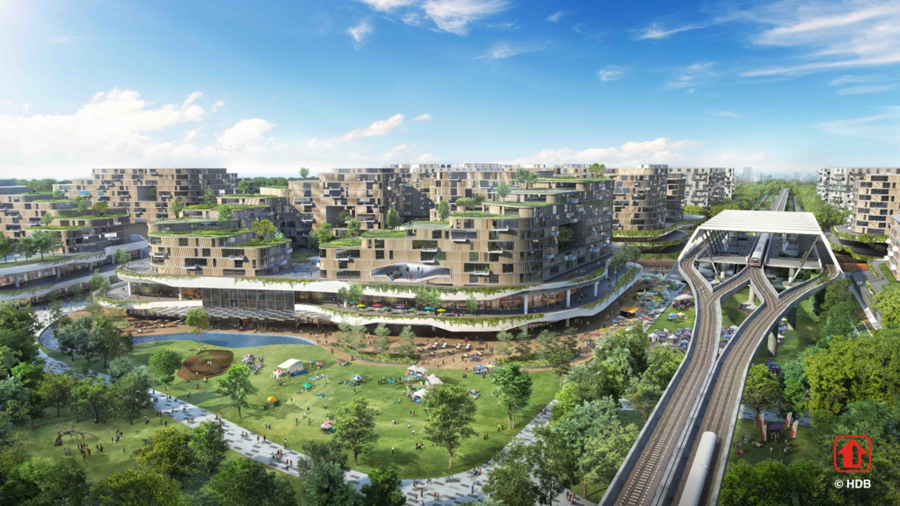

```{r libraries, include= FALSE}
library(prettydoc)
library(plyr)
library(dplyr)
library(RColorBrewer)
library(leaflet)
library(geojsonio)
library(ggplot2)
library(gganimate)
library(gifski)
library(data.table)
library(ggrepel)
library(plotly)
library(shiny)
library(rgeos)
library(zoo)
library(htmlwidgets)
library(htmltools)
library(animation)
```


```{r setup, include=FALSE}
knitr::opts_chunk$set(echo = TRUE)
knitr::opts_chunk$set(fig.align = 'center')
```

***
# Contents

* **Headlines**
  + Forecasting Tengah Town
  + Is $1m HDB Becoming The Norm?
  + Predicting HDB Resale Prices

* **Visualizations**
  + Remaking Our Heartland 
  + Relationship Between POI and Resale Price
  + Why Prices Drastically Increase From 2007 Onwards 
  + Value Comparison Between Mature Towns And Non-Mature Towns
  + Does Premium/Non-standard HDBs account for high resale value? 
  + Compare HDB Median Resale Price Per Town
 
***
 

<center> <h1>Headlines</h1> </center>
<style>
body {
text-align: justify}
</style>


The R Markdown report will comprehensively cover the aspects of HDB Resale Prices from the early 90s to the current year. Through analysis of the dataset, we will produce quality and informative insights, graphs accompanying the insights as well as a predictive model. We hope that through this document, it will aid users in their decision making process and other general purposes. 

&nbsp;
&nbsp;

***

## Will Tengah Property Prices See The Same Rise As Punggol?

<style>
body {
text-align: justify}
</style>

<style>
.html-widget {
    margin: auto;
}
</style>

When Punggol was first unveiled 1996 by former Prime Minister, Goh Chok Tong, there was a vision to make it the Waterfront Town in the 21st Century. Located in the northeast region of Singapore, bordered by the Singapore shoreline as as well as the Strait of Johor, there was an ambitious plan to transform the old village of Punggol into a waterfront town with residential housing occupying along the rivers and coastal areas.

Subsequently in 2007, Punggol was selected as one of the pilot towns under the Remaking Our Heartland (ROH) programme. It included a master plan to further realise the vision of Punggol as a waterfront town. One of the plan includes a man-made waterway that goes through the town, bringing in opportunities for authentic waterfront living and exciting water-based activities.

Come 2017, just 10 years after the ROH programme was introduced, prices have skyrocketted to nearly $900,000. This mark a new milestone in the HDB resale market for the suburban town in the region.

``` {r H1G1 Code, echo=FALSE, include=FALSE}
Punggol <- read.csv("./Datasets/HDB Resale Prices.csv")
Punggol$month <- as.Date(paste0(Punggol$month, "-01"), "%Y-%m-%d")
Punggol$year <- format(as.Date(Punggol$month, format="%Y-%m-%d"),"%Y")
Punggol2 <- filter(Punggol, month >= "2007-01-01",town == "PUNGGOL")

type22007<-filter(Punggol2, Punggol2$flat_type=="2 ROOM", Punggol2$year=="2007")
type22008<-filter(Punggol2, Punggol2$flat_type=="2 ROOM", Punggol2$year=="2008")
type22009<-filter(Punggol2, Punggol2$flat_type=="2 ROOM", Punggol2$year=="2009")
type22010<-filter(Punggol2, Punggol2$flat_type=="2 ROOM", Punggol2$year=="2010")
type22011<-filter(Punggol2, Punggol2$flat_type=="2 ROOM", Punggol2$year=="2011")
type22012<-filter(Punggol2, Punggol2$flat_type=="2 ROOM", Punggol2$year=="2012")
type22013<-filter(Punggol2, Punggol2$flat_type=="2 ROOM", Punggol2$year=="2013")
type22014<-filter(Punggol2, Punggol2$flat_type=="2 ROOM", Punggol2$year=="2014")
type22015<-filter(Punggol2, Punggol2$flat_type=="2 ROOM", Punggol2$year=="2015")
type22016<-filter(Punggol2, Punggol2$flat_type=="2 ROOM", Punggol2$year=="2016")
type22017<-filter(Punggol2, Punggol2$flat_type=="2 ROOM", Punggol2$year=="2017")

a2007<-as.integer(mean(type22007$resale_price))
a2008<-as.integer(mean(type22008$resale_price))
a2009<-as.integer(mean(type22009$resale_price))
a2010<-as.integer(mean(type22010$resale_price))
a2011<-as.integer(mean(type22011$resale_price))
a2012<-as.integer(mean(type22012$resale_price))
a2013<-as.integer(mean(type22013$resale_price))
a2014<-as.integer(mean(type22014$resale_price))
a2015<-as.integer(mean(type22015$resale_price))
a2016<-as.integer(mean(type22016$resale_price))
a2017<-as.integer(mean(type22017$resale_price))

type32007<-filter(Punggol2, Punggol2$flat_type=="3 ROOM", Punggol2$year == "2007")
type32008<-filter(Punggol2, Punggol2$flat_type=="3 ROOM", Punggol2$year == "2008")
type32009<-filter(Punggol2, Punggol2$flat_type=="3 ROOM", Punggol2$year == "2009")
type32010<-filter(Punggol2, Punggol2$flat_type=="3 ROOM", Punggol2$year == "2010")
type32011<-filter(Punggol2, Punggol2$flat_type=="3 ROOM", Punggol2$year == "2011")
type32012<-filter(Punggol2, Punggol2$flat_type=="3 ROOM", Punggol2$year == "2012")
type32013<-filter(Punggol2, Punggol2$flat_type=="3 ROOM", Punggol2$year == "2013")
type32014<-filter(Punggol2, Punggol2$flat_type=="3 ROOM", Punggol2$year == "2014")
type32015<-filter(Punggol2, Punggol2$flat_type=="3 ROOM", Punggol2$year == "2015")
type32016<-filter(Punggol2, Punggol2$flat_type=="3 ROOM", Punggol2$year == "2016")
type32017<-filter(Punggol2, Punggol2$flat_type=="3 ROOM", Punggol2$year == "2017")

b2007<-as.integer(mean(type32007$resale_price))
b2008<-as.integer(mean(type32008$resale_price))
b2009<-as.integer(mean(type32009$resale_price))
b2010<-as.integer(mean(type32010$resale_price))
b2011<-as.integer(mean(type32011$resale_price))
b2012<-as.integer(mean(type32012$resale_price))
b2013<-as.integer(mean(type32013$resale_price))
b2014<-as.integer(mean(type32014$resale_price))
b2015<-as.integer(mean(type32015$resale_price))
b2016<-as.integer(mean(type32016$resale_price))
b2017<-as.integer(mean(type32017$resale_price))

type42007<-filter(Punggol2, Punggol2$flat_type=="4 ROOM", Punggol2$year=="2007")
type42008<-filter(Punggol2, Punggol2$flat_type=="4 ROOM", Punggol2$year=="2008")
type42009<-filter(Punggol2, Punggol2$flat_type=="4 ROOM", Punggol2$year=="2009")
type42010<-filter(Punggol2, Punggol2$flat_type=="4 ROOM", Punggol2$year=="2010")
type42011<-filter(Punggol2, Punggol2$flat_type=="4 ROOM", Punggol2$year=="2011")
type42012<-filter(Punggol2, Punggol2$flat_type=="4 ROOM", Punggol2$year=="2012")
type42013<-filter(Punggol2, Punggol2$flat_type=="4 ROOM", Punggol2$year=="2013")
type42014<-filter(Punggol2, Punggol2$flat_type=="4 ROOM", Punggol2$year=="2014")
type42015<-filter(Punggol2, Punggol2$flat_type=="4 ROOM", Punggol2$year=="2015")
type42016<-filter(Punggol2, Punggol2$flat_type=="4 ROOM", Punggol2$year=="2016")
type42017<-filter(Punggol2, Punggol2$flat_type=="4 ROOM", Punggol2$year=="2017")

c2007<-as.integer(mean(type42007$resale_price))
c2008<-as.integer(mean(type42008$resale_price))
c2009<-as.integer(mean(type42009$resale_price))
c2010<-as.integer(mean(type42010$resale_price))
c2011<-as.integer(mean(type42011$resale_price))
c2012<-as.integer(mean(type42012$resale_price))
c2013<-as.integer(mean(type42013$resale_price))
c2014<-as.integer(mean(type42014$resale_price))
c2015<-as.integer(mean(type42015$resale_price))
c2016<-as.integer(mean(type42016$resale_price))
c2017<-as.integer(mean(type42017$resale_price))

type52007<-filter(Punggol2, Punggol2$flat_type=="5 ROOM", Punggol2$year == "2007")
type52008<-filter(Punggol2, Punggol2$flat_type=="5 ROOM", Punggol2$year == "2008")
type52009<-filter(Punggol2, Punggol2$flat_type=="5 ROOM", Punggol2$year == "2009")
type52010<-filter(Punggol2, Punggol2$flat_type=="5 ROOM", Punggol2$year == "2010")
type52011<-filter(Punggol2, Punggol2$flat_type=="5 ROOM", Punggol2$year == "2011")
type52012<-filter(Punggol2, Punggol2$flat_type=="5 ROOM", Punggol2$year == "2012")
type52013<-filter(Punggol2, Punggol2$flat_type=="5 ROOM", Punggol2$year == "2013")
type52014<-filter(Punggol2, Punggol2$flat_type=="5 ROOM", Punggol2$year == "2014")
type52015<-filter(Punggol2, Punggol2$flat_type=="5 ROOM", Punggol2$year == "2015")
type52016<-filter(Punggol2, Punggol2$flat_type=="5 ROOM", Punggol2$year == "2016")
type52017<-filter(Punggol2, Punggol2$flat_type=="5 ROOM", Punggol2$year == "2017")

d2007<-as.integer(mean(type52007$resale_price))
d2008<-as.integer(mean(type52008$resale_price))
d2009<-as.integer(mean(type52009$resale_price))
d2010<-as.integer(mean(type52010$resale_price))
d2011<-as.integer(mean(type52011$resale_price))
d2012<-as.integer(mean(type52012$resale_price))
d2013<-as.integer(mean(type52013$resale_price))
d2014<-as.integer(mean(type52014$resale_price))
d2015<-as.integer(mean(type52015$resale_price))
d2016<-as.integer(mean(type52016$resale_price))
d2017<-as.integer(mean(type52017$resale_price))

type62007<-filter(Punggol2, Punggol2$flat_type=="EXECUTIVE", Punggol2$year == "2007")
type62008<-filter(Punggol2, Punggol2$flat_type=="EXECUTIVE", Punggol2$year == "2008")
type62009<-filter(Punggol2, Punggol2$flat_type=="EXECUTIVE", Punggol2$year == "2009")
type62010<-filter(Punggol2, Punggol2$flat_type=="EXECUTIVE", Punggol2$year == "2010")
type62011<-filter(Punggol2, Punggol2$flat_type=="EXECUTIVE", Punggol2$year == "2011")
type62012<-filter(Punggol2, Punggol2$flat_type=="EXECUTIVE", Punggol2$year == "2012")
type62013<-filter(Punggol2, Punggol2$flat_type=="EXECUTIVE", Punggol2$year == "2013")
type62014<-filter(Punggol2, Punggol2$flat_type=="EXECUTIVE", Punggol2$year == "2014")
type62015<-filter(Punggol2, Punggol2$flat_type=="EXECUTIVE", Punggol2$year == "2015")
type62016<-filter(Punggol2, Punggol2$flat_type=="EXECUTIVE", Punggol2$year == "2016")
type62017<-filter(Punggol2, Punggol2$flat_type=="EXECUTIVE", Punggol2$year == "2017")

e2007<-as.integer(mean(type62007$resale_price))
e2008<-as.integer(mean(type62008$resale_price))
e2009<-as.integer(mean(type62009$resale_price))
e2010<-as.integer(mean(type62010$resale_price))
e2011<-as.integer(mean(type62011$resale_price))
e2012<-as.integer(mean(type62012$resale_price))
e2013<-as.integer(mean(type62013$resale_price))
e2014<-as.integer(mean(type62014$resale_price))
e2015<-as.integer(mean(type62015$resale_price))
e2016<-as.integer(mean(type62016$resale_price))
e2017<-as.integer(mean(type62017$resale_price))

type4and52007<-filter(Punggol2, Punggol2$year=="2007"| Punggol2$flat_type=="4 ROOM"& Punggol2$flat_type=="5 ROOM")
type4and52008<-filter(Punggol2, Punggol2$year=="2008"| Punggol2$flat_type=="4 ROOM"& Punggol2$flat_type=="5 ROOM")
type4and52009<-filter(Punggol2, Punggol2$year=="2009"| Punggol2$flat_type=="4 ROOM"& Punggol2$flat_type=="5 ROOM")
type4and52010<-filter(Punggol2, Punggol2$year=="2010"| Punggol2$flat_type=="4 ROOM"& Punggol2$flat_type=="5 ROOM")
type4and52011<-filter(Punggol2, Punggol2$year=="2011"| Punggol2$flat_type=="4 ROOM"& Punggol2$flat_type=="5 ROOM")
type4and52012<-filter(Punggol2, Punggol2$year=="2012"| Punggol2$flat_type=="4 ROOM"& Punggol2$flat_type=="5 ROOM")
type4and52013<-filter(Punggol2, Punggol2$year=="2013"| Punggol2$flat_type=="4 ROOM"& Punggol2$flat_type=="5 ROOM")
type4and52014<-filter(Punggol2, Punggol2$year=="2014"| Punggol2$flat_type=="4 ROOM"& Punggol2$flat_type=="5 ROOM")
type23452015<-filter(Punggol2, Punggol2$year=="2015"| Punggol2$flat_type=="2 ROOM"& Punggol2$flat_type=="3 ROOM"&Punggol2$flat_type=="4 ROOM"& Punggol2$flat_type=="5 ROOM")
type23452016<-filter(Punggol2, Punggol2$year=="2016"| Punggol2$flat_type=="2 ROOM"& Punggol2$flat_type=="3 ROOM"&Punggol2$flat_type=="4 ROOM"& Punggol2$flat_type=="5 ROOM")
type23452017<-filter(Punggol2, Punggol2$year=="2017"| Punggol2$flat_type=="2 ROOM"& Punggol2$flat_type=="3 ROOM"&Punggol2$flat_type=="4 ROOM"& Punggol2$flat_type=="5 ROOM")

f2007<-as.integer(mean(type4and52007$resale_price))
f2008<-as.integer(mean(type4and52008$resale_price))
f2009<-as.integer(mean(type4and52009$resale_price))
f2010<-as.integer(mean(type4and52010$resale_price))
f2011<-as.integer(mean(type4and52011$resale_price))
f2012<-as.integer(mean(type4and52012$resale_price))
f2013<-as.integer(mean(type4and52013$resale_price))
f2014<-as.integer(mean(type4and52014$resale_price))
f2015<-as.integer(mean(type23452015$resale_price))
f2016<-as.integer(mean(type23452016$resale_price))
f2017<-as.integer(mean(type23452017$resale_price))

Year <- c("2007","2008","2009","2010","2011","2012","2013","2014","2015","2016","2017")

tworoom <- c(a2007,a2008,a2009,a2010,a2011,a2012,a2013,a2014,a2015,a2016,a2017)
threeroom <- c(b2007,b2008,b2009,b2010,b2011,b2012,b2013,b2014,b2015,b2016,b2017)
fourroom <- c(c2007,c2008,c2009,c2010,c2011,c2012,c2013,c2014,c2015,c2016,c2017)
fiveroom <- c(d2007,d2008,d2009,d2010,d2011,d2012,d2013,d2014,d2015,d2016,d2017)
executive <- c(e2007,e2008,e2009,e2010,e2011,e2012,e2013,e2014,e2015,e2016,e2017)
average <- c(f2007,f2008,f2009,f2010,f2011,f2012,f2013,f2014,f2015,f2016,f2017)

Punggoldf <- data.frame(Year,tworoom,threeroom,fourroom,fiveroom,executive,average)

is.nan.data.frame <- function(x)
  do.call(cbind, lapply(x, is.nan))

Punggoldf[is.nan(Punggoldf)] <- 0
```

```{r H1G1, message = FALSE, warning = FALSE, echo=FALSE }

p <- plot_ly(
  type = 'table',
  header = list(
    values = c('<b>YEAR</b>', '<b>2 Room</b>','<b>3 Room</b>','<b>4 Room</b>','<b>5 Room</b>','<b>Executive<b>','<b>Total<b>'),
    line = list(color = '#506784'),
    fill = list(color = 'red'),
    align = 'center',
    font = list(color = 'white', size = 12),
    width = 100, height = 50
  ),
  cells = list(
    values = rbind(
      c("<b>2007<b>","<b>2008<b>","<b>2009<b>","<b>2010<b>","<b>2011<b>","<b>2012<b>","<b>2013<b>","<b>2014<b>","<b>2015<b>","<b>2016<b>","<b>2017<b>", '<b>2008 vs 2018</b>'),
      c(a2007,a2008,a2009,a2010,a2011,a2012,a2013,a2014,a2015,a2016,a2017,"null"),
      c(b2007,b2008,b2009,b2010,b2011,b2012,b2013,b2014,b2015,b2016,b2017,"null"),
      c(c2007,c2008,c2009,c2010,c2011,c2012,c2013,c2014,c2015,c2016,c2017,"<b>71.4%<b>"),
      c(d2007,d2008,d2009,d2010,d2011,d2012,d2013,d2014,d2015,d2016,d2017,"<b>48.2%<b>"),
      c(e2007,e2008,e2009,e2010,e2011,e2012,e2013,e2014,e2015,e2016,e2017,"<b>41.6%<b>"),
      c(f2007,f2008,f2009,f2010,f2011,f2012,f2013,f2014,f2015,f2016,f2017,"<b>50.5%<b>")),
    line = list(color = '#506784'),
    fill = list(color = c('#FA8072', 'white')),
    align = 'center',
    font = list(color = c('black'), size = 12),
    width = 100, height = 30
  ))
p

```

The table above shows the changes in average resale prices of Punggol from 2007 to 2017 and per flat type from 2 Room flats to Executive flats. Due to Punggol's early age, the resale value of 2 Room flats and 3 Room flats is not available until 2015.

From the table we can see that **on average, there has been a 50% increase in resale value between 2007 and 2017**. 4 Room HDB has seen an increase of about **71%**, while 5 Room **49%** and Executive flats **41%**.

```{r H1G2 Code, message = FALSE, warning = FALSE, results = FALSE,echo=FALSE}

Price <- c(a2007,a2008,a2009,a2010,a2011,a2012,a2013,a2014,a2015,a2016,a2017,
           b2007,b2008,b2009,b2010,b2011,b2012,b2013,b2014,b2015,b2016,b2017,
           c2007,c2008,c2009,c2010,c2011,c2012,c2013,c2014,c2015,c2016,c2017,
           d2007,d2008,d2009,d2010,d2011,d2012,d2013,d2014,d2015,d2016,d2017,
           e2007,e2008,e2009,e2010,e2011,e2012,e2013,e2014,e2015,e2016,e2017,
           f2007,f2008,f2009,f2010,f2011,f2012,f2013,f2014,f2015,f2016,f2017)

Years <- c("2007","2008","2009","2010","2011","2012","2013","2014","2015","2016","2017",
           "2007","2008","2009","2010","2011","2012","2013","2014","2015","2016","2017",
           "2007","2008","2009","2010","2011","2012","2013","2014","2015","2016","2017",
           "2007","2008","2009","2010","2011","2012","2013","2014","2015","2016","2017",
           "2007","2008","2009","2010","2011","2012","2013","2014","2015","2016","2017",
           "2007","2008","2009","2010","2011","2012","2013","2014","2015","2016","2017")

Flat_Type <- c("2 Room","2 Room","2 Room","2 Room","2 Room","2 Room","2 Room","2 Room","2 Room","2 Room","2 Room",
               "3 Room","3 Room","3 Room","3 Room","3 Room","3 Room","3 Room","3 Room","3 Room","3 Room","3 Room",
               "4 Room","4 Room","4 Room","4 Room","4 Room","4 Room","4 Room","4 Room","4 Room","4 Room","4 Room",
               "5 Room","5 Room","5 Room","5 Room","5 Room","5 Room","5 Room","5 Room","5 Room","5 Room","5 Room",
               "Executive","Executive","Executive","Executive","Executive","Executive","Executive","Executive","Executive","Executive","Executive",
               "Average","Average","Average","Average","Average","Average","Average","Average","Average","Average","Average")

kgif <- data.frame(Price,Years,Flat_Type)
kgif$Price <- as.numeric(as.character(kgif$Price))
kgif$Years <- as.numeric(as.character(kgif$Years))

```

```{r H1G2, message = FALSE, warning = FALSE, results = FALSE,echo=FALSE}
k <- ggplot(
  kgif,
  aes(Years,Price, group = Flat_Type, color = factor(Flat_Type), label = Flat_Type)
) +
  geom_line() +
  scale_color_viridis_d() +
  labs(x = "Years", y = "Average Resale Prices") +
  ggtitle("Average Resale Prices of Punggol between 2007 to 2017") +
  theme(legend.position = "top") +
  guides(color=guide_legend(title="Flat Type")) +
  geom_label() +
  geom_point(aes(group = seq_along(Years)), size = 7) +
  transition_reveal(Years)

k + theme(plot.title = element_text(color="black", size=14, face="bold"),
          axis.title.x = element_text(color="black", size=14, face="bold"),
          axis.title.y = element_text(color="black", size=14, face="bold"))


anim_save("k.gif", k)
```


The graph shows the resale price per flat type and total average year-to-year. As the town continue to mature, new amenities and points of interest are built and formed. So it is not surprising to see the resale price to gradually rise. It is interesting however, to see ROH play a part from 2007 onwards as it was the year it started. 


### Will Tengah experience the same growth?
 

HDB's newest town in over 20 years since Punggol, Tengah will no doubt be the new town to conquer the headlines in years to come. Located in the west, it is bounded by Choa Chu Kang and Jurong East. It will be HDB first ever car free and nature centric town. HDB envisioned Tengah to be a **"Forest Town"**, designed to be sustainable, green and full of smart features. There are already sayings that Tengah will be the next Punggol - but is it really?

Tengah, like Punggol started off with a blank state but Punggol town has established itself as a modern digital town with plans to make it the next digital district. While Tengah has position itself a green town, those who likes nature and lush greenery. Therefore the appeals of each town are different. It took years for Punggol town to be built up as it is today and it could take the same for Tengah to do the same. Furthermore, the Jurong Region Line will potentially inject capital appreciation of the area of Tengah. 

All in all, with Punggol featuring a Waterfront Living, Punggol Digital District and North East Line MRT Line it is able to command a high resale price. In time with Tengah featuring a Forest Town, Jurong Innovation District and Jurong Region MRT Line, we believe it too can provide a near similar growth or even higher as Jurong East which is envisioned to be Singapore's second CBD is located next to Tengah.

***

## Will million dollar HDB flats be new new norm?
 

Over the years, HDB flats reaching close or at the $1 million mark has dominated the property headlines. Seeing HDB flats sold at that price seems bewildering. Many will wonder whether HDB mean affordable housing anymore? And will we expect to see million dollar HDB becoming the norm, potentially competiting with the Private Property market? 

Below is an interactive map, marking each HDB flat that was transacted with the highest price per town. Click on the HDB icon to see the town and the amount that it was transacted. 

```{r map Code, echo=FALSE, include=FALSE}
top <- read.csv("./Datasets/TopTown.csv")
top <- as.data.frame(top)
topname<-top$Name
coordinates(top) <- ~Longitude + Latitude


HDBIcon <- makeIcon(
  iconUrl = "./Images/nDPK2G0I_400x400.jpg",
  iconWidth = 20, iconHeight = 30,
  iconAnchorX = 10, iconAnchorY = 30)

tag.map.title <- tags$style(HTML("
  .leaflet-control.map-title { 
    transform: translate(-50%,20%);
    left: 50%;
    text-align: center;
    padding-left: 10px; 
    padding-right: 10px; 
    background: rgba(255,255,255,0.75);
    font-weight: bold;
    font-size: 28px;
  }
"))

title <- tags$div(
  tag.map.title, HTML("Most Expensive Flat Per Town")
)  


```

```{r map,echo=FALSE}
leaflet() %>%
  addTiles() %>%
  addMarkers(data=top, popup = topname, icon=HDBIcon) %>%
  addControl(title, position = "topright", className="map-title")

```

For our graph below, we use $900,000 rather than $1,000,000 as the benchmark for high resale prices mainly for two reasons. First, sellers whose flat value is near the million dollar mark would like to set their prices at least $1,000,000 but are often negotiated down. And second, is is for the purpose of a more effective graph. If it were set to $1,000,000, there wouldn't be enough data points to form a effective insight. Therefore, setting it at $900,000 is a more realistic benchmark.
```{r H2G1 Code, echo=FALSE, include=FALSE}

hdb2 <- read.csv("./Datasets/HDB Resale Prices.csv")
hdb2$month <- as.Date(paste0(hdb2$month, "-01"), "%Y-%m-%d")
hdb3 <- filter(hdb2, month >= "2012-01-01")
hdb4 <- filter(hdb3, flat_type == "4 ROOM" | 
                     flat_type == "5 ROOM" | 
                     flat_type == "EXECUTIVE" | 
                     flat_type == "MULTI-GENERATION")

hdb5 <- filter(hdb4, resale_price >= 900000)
hdb6 <- count(hdb5, "flat_type")
hdb7 <- data.frame(hdb5$flat_type, hdb5$resale_price, hdb5$month)
hdb7$hdb5.resale_price <- 1
sum(hdb7$hdb5.resale_price)
```

```{r H2G1, echo=FALSE}
setDT(hdb7)[,hdb5.month := as.IDate(hdb5.month)]
ggplot(hdb7[,sum(hdb5.resale_price), by=.(hdb5.flat_type, year(hdb5.month))], aes(x=year, y=V1, fill=hdb5.flat_type)) +
  geom_bar(stat = "identity") +
  geom_label_repel(aes(label=V1), vjust=0) +
  ggtitle("Resale flats above $900K by Year") +
  xlab("Year") + ylab("Transaction Volume") +
  labs(fill='Flat Type') 
```

In the graph, it shows the number of resale flats that are sold above $900,000 and split by type of flat between 2012 to 2017. We can see that there is a sharp increase in transaction from 2015 onwards. Also previously, it was only 5 Room, Executive and Multi-Generation flat types that were able to command those prices but since 2015, we can see that 4 Rooms are starting to set their prices above $900,000. Furthermore,we can see that the most of the transaction were due to 5 Room flats which makes up about **70%** in the year 2017 and we can predict that it will continue to increase in the forseable future. 

```{r H2G2 code, message = FALSE, warning = FALSE, results = FALSE,echo=FALSE}
hdb8 <- filter(hdb3, flat_type == "4 ROOM" | 
                 flat_type == "5 ROOM" | 
                 flat_type == "EXECUTIVE" | 
                 flat_type == "MULTI-GENERATION")

hdb9 <- data.frame(hdb8$flat_type, hdb8$month)
hdb9$year <- substring(hdb9$hdb8.month,1,4)

i <- sapply(hdb9, is.factor)
hdb9[i] <- lapply(hdb9[i], as.character)

hdb9$year <- as.numeric(as.character(hdb9$year))

hdb4R2012 <- nrow(subset(hdb9,hdb8.flat_type == '4 ROOM' & hdb9$year=='2012'))
hdb5R2012 <- nrow(subset(hdb9,hdb8.flat_type == '5 ROOM' & hdb9$year=='2012'))
hdbEX2012 <- nrow(subset(hdb9,hdb8.flat_type == 'EXECUTIVE' & hdb9$year=='2012'))
hdbMG2012 <- nrow(subset(hdb9,hdb8.flat_type == 'MULTI-GENERATION' & hdb9$year=='2012'))

hdb4R2013 <- nrow(subset(hdb9,hdb8.flat_type == '4 ROOM' & hdb9$year=='2013'))
hdb5R2013 <- nrow(subset(hdb9,hdb8.flat_type == '5 ROOM' & hdb9$year=='2013'))
hdbEX2013 <- nrow(subset(hdb9,hdb8.flat_type == 'EXECUTIVE' & hdb9$year=='2013'))
hdbMG2013 <- nrow(subset(hdb9,hdb8.flat_type == 'MULTI-GENERATION' & hdb9$year=='2013'))

hdb4R2014 <- nrow(subset(hdb9,hdb8.flat_type == '4 ROOM' & hdb9$year=='2014'))
hdb5R2014 <- nrow(subset(hdb9,hdb8.flat_type == '5 ROOM' & hdb9$year=='2014'))
hdbEX2014 <- nrow(subset(hdb9,hdb8.flat_type == 'EXECUTIVE' & hdb9$year=='2014'))
hdbMG2014 <- nrow(subset(hdb9,hdb8.flat_type == 'MULTI-GENERATION' & hdb9$year=='2014'))

hdb4R2015 <- nrow(subset(hdb9,hdb8.flat_type == '4 ROOM' & hdb9$year=='2015'))
hdb5R2015 <- nrow(subset(hdb9,hdb8.flat_type == '5 ROOM' & hdb9$year=='2015'))
hdbEX2015 <- nrow(subset(hdb9,hdb8.flat_type == 'EXECUTIVE' & hdb9$year=='2015'))
hdbMG2015 <- nrow(subset(hdb9,hdb8.flat_type == 'MULTI-GENERATION' & hdb9$year=='2015'))

hdb4R2016 <- nrow(subset(hdb9,hdb8.flat_type == '4 ROOM' & hdb9$year=='2016'))
hdb5R2016 <- nrow(subset(hdb9,hdb8.flat_type == '5 ROOM' & hdb9$year=='2016'))
hdbEX2016 <- nrow(subset(hdb9,hdb8.flat_type == 'EXECUTIVE' & hdb9$year=='2016'))
hdbMG2016 <- nrow(subset(hdb9,hdb8.flat_type == 'MULTI-GENERATION' & hdb9$year=='2016'))

hdb4R2017 <- nrow(subset(hdb9,hdb8.flat_type == '4 ROOM' & hdb9$year=='2017'))
hdb5R2017 <- nrow(subset(hdb9,hdb8.flat_type == '5 ROOM' & hdb9$year=='2017'))
hdbEX2017 <- nrow(subset(hdb9,hdb8.flat_type == 'EXECUTIVE' & hdb9$year=='2017'))
hdbMG2017 <- nrow(subset(hdb9,hdb8.flat_type == 'MULTI-GENERATION' & hdb9$year=='2017'))

Volume <- c(hdb4R2012,hdb4R2013,hdb4R2014,hdb4R2015,hdb4R2016,hdb4R2017,
            hdb5R2012,hdb5R2013,hdb5R2014,hdb5R2015,hdb5R2016,hdb5R2017,
            hdbEX2012,hdbEX2013,hdbEX2014,hdbEX2015,hdbEX2016,hdbEX2017,
            hdbMG2012,hdbMG2013,hdbMG2014,hdbMG2015,hdbMG2016,hdbMG2017)


Flat_Type <- c("4 Room","4 Room","4 Room","4 Room","4 Room","4 Room",
               "5 Room","5 Room","5 Room","5 Room","5 Room","5 Room",
               "Executive","Executive","Executive","Executive","Executive","Executive",
               "Multi-Generation","Multi-Generation","Multi-Generation","Multi-Generation","Multi-Generation","Multi-Generation")

Year <- c("2012","2013","2014","2015","2016","2017",
          "2012","2013","2014","2015","2016","2017",
          "2012","2013","2014","2015","2016","2017",
          "2012","2013","2014","2015","2016","2017")


finalhdb <- data.frame(Volume,Year,Flat_Type)

finalhdb$Year <- as.numeric(as.character(finalhdb$Year))
```

```{r H2G2, message = FALSE, warning = FALSE, results = FALSE, echo=FALSE}
p <- ggplot(
  finalhdb,
  aes(Year,Volume, group = Flat_Type, color = factor(Flat_Type), label = Flat_Type)
) +
  geom_line() +
  scale_color_viridis_d() +
  labs(x = "Years", y = "Transaction Volume") +
  ggtitle("Volume of flats sold over the years") +
  theme(legend.position = "top") +
  guides(color=guide_legend(title="Flat Type")) +
  geom_label() +
  geom_point(aes(group = seq_along(Year)), size = 7) +
  transition_reveal(Year) 

p + theme(plot.title = element_text(color="black", size=14, face="bold"),
          axis.title.x = element_text(color="black", size=14, face="bold"),
          axis.title.y = element_text(color="black", size=14, face="bold"))

anim_save("p.gif", p)

```


This graph shows the timeline of HDB flats that were sold per flat type, year by year from 2012 onwards. Interestingly, between 2012 and 2013, there is a significant drop in transaction volume across all flat types except for Multi-Generation which manages to stay the same. Afterwards, we can see a gradual increase in transaction volume from 2014 onwards. While 5 Room flats, Executive and Multi-Generation flat types are able to command higher prices, their individual volume is still lower that 4 Room HDB flats.

```{r H2G3 Code, echo=FALSE, include=FALSE}

million <- nrow(hdb7)
total <- nrow(hdb4)
nonmillion <- total - million

percentagemil <- million/total * 100
percentagemil <- format(round(percentagemil, 2), nsmall = 2)
percentagemil <- paste0(percentagemil,'%')
hh
str(percentagemil)
percentagenonmil <- nonmillion/total * 100
percentagenonmil <- format(round(percentagenonmil, 2), nsmall = 2)
percentagenonmil <- paste0(percentagenonmil,'%')
```

```{r H2G3, echo=FALSE }
p <- plot_ly(
  type = 'table',
  header = list(
    values = c('<b>2012-2017</b>','<b>$900,000+ HDBs</b>','<b>Non $900,000+ HDB</b>','<b>Total HDB</b>'),
    line = list(color = '#506784'),
    fill = list(color = 'red'),
    align = c('left','center'),
    font = list(color = 'white', size = 14),
    width = 100, height = 50
  ),
  cells = list(
    values = rbind(
      c('<b>Count of HDB<b>','<b>Percentage<b>'),
      c(million,percentagemil),
      c(nonmillion,percentagenonmil),
      c(total,"<b>100%<b>")),
    line = list(color = '#506784'),
    fill = list(color = c('#FA8072', 'white')),
    align = c('left', 'center'),
    font = list(color = c('black'), size = 14),
    width = 100, height = 50
  ))
p
```

It is true that the number of flats that are selling at high prices has indeed increased, this might not be as alarming. The table below shows the percentage of flats sold that have exceeded the $900,000 from the period of 2012 to 2017. Rest assured that the increase in those flats sold is still below one percent which is **0.80%** of all flats in that period. Therefore, $1,000,000 HDB flats will still be considered an exception and not the norm for the foreseeable future.

***

## Here's what to expect for the upcoming "Average Price per Square Meter" for different Flat Types in the next 10 months

```{r P1G1, echo = FALSE, include=FALSE}
resale <- read.csv("HDB Resale Prices.csv")
library(dplyr)

levels(resale$resale_price)

resale <- read.csv("./Datasets/HDB1.csv")

#install.packages("shiny")
library(shiny)

library(dplyr)


#ONE ROOM
#Codes from Line 13 to Line 192 is repeated but with different filters of Flat Types
#We decided to filter the years starting from 2012. Then by choosing 1 Room flats, we aim to predict the future prices of the Price per Square Meter
resale <- read.csv("./Datasets/HDB1.csv")
resale <- filter(resale, Year >= 2012)
resale <- filter(resale, resale$flat_type == "1 ROOM")

#Changing the column of resale price to from factor to numeric
resale$resale_price <- as.numeric(levels(resale$resale_price))[resale$resale_price]

#Calculate and bind PriceArea into 'resale' dataset using formula
resale$PriceArea <- resale$resale_price/resale$floor_area_sqm

#finding the aggregate of the of each month's PriceArea
#using ts() to identify the number of months in a year, from first and last observation, freq = 12 for monthly)
monthly = aggregate(PriceArea~month, FUN=mean, data=resale)
monthly_ts = ts(monthly$PriceArea,start = c(2012,3), frequency=12)
plot(monthly_ts, xlab="Year", ylab="Average Price per Square Meter")


#ACF is used to determine stationarity and seasonality
#Noticing how the graph from above is non-stationary, we use acf to ascertain this indication as seen in the 2 acfs,
#the ACF is decaying very slowly.
par(mfrow = c(1,2), pty = "s")
acf(monthly_ts, xlab="Lag (in years)")
acf(diff(monthly_ts), xlab="Lag (in years)")

library(forecast)
#Predicting expected values in the future
fit2 = auto.arima(log10(monthly_ts), approximation = F,trace= F)
summary(fit2)


#Formulated to predict future prices. Lines in orange shows the limits and blue indicates the expected flow of value of Average Price per Square Meter
prediction = predict(fit2, n.ahead=10)
plot(monthly_ts, type ="l", xlab="", ylab = "Average Price per Square Meter", xlim = c(2012,2019),ylim = c(5000,9000), main="ARIMA prediction") + 
  lines(10^(prediction$pred),col="blue") + 
  lines(10^(prediction$pred+2*prediction$se),col="orange") +
  lines(10^(prediction$pred-2*prediction$se),col="orange")

p1.base <- recordPlot()

#TWO ROOM
resale <- read.csv("./Datasets/HDB1.csv")

resale <- filter(resale, Year >= 2012)
resale <- filter(resale, flat_type == "2 ROOM")

resale$resale_price <- as.numeric(levels(resale$resale_price))[resale$resale_price]
resale$PriceArea <- resale$resale_price/resale$floor_area_sqm

head(resale)

monthly = aggregate(PriceArea~month, FUN=mean, data=resale)
monthly_ts = ts(monthly$PriceArea,start = c(2012,3), frequency=12)
plot(monthly_ts, xlab="Year", ylab="Average Resale Flat Price")

par(mfrow = c(1,2), pty = "s")
acf(monthly_ts, xlab="Lag (in years)")
acf(diff(monthly_ts), xlab="Lag (in years)")

library(forecast)
fit2 = auto.arima(log10(monthly_ts), approximation = F,trace= F)
summary(fit2)

prediction = predict(fit2, n.ahead=10)
plot(monthly_ts, type ="l", xlab="", ylab = "Average Price per Square Meter", xlim = c(2012,2019),ylim = c(4500,6500), main="ARIMA prediction") +
  lines(10^(prediction$pred),col="blue") +
  lines(10^(prediction$pred+2*prediction$se),col="orange") +
  lines(10^(prediction$pred-2*prediction$se),col="orange")

p2.base <- recordPlot()

#THREE ROOM
resale <- read.csv("./Datasets/HDB1.csv")
resale <- filter(resale, Year >= 2012)
resale <- filter(resale, flat_type == "3 ROOM")

resale$resale_price <- as.numeric(levels(resale$resale_price))[resale$resale_price]
resale$PriceArea <- resale$resale_price/resale$floor_area_sqm

monthly = aggregate(PriceArea~month, FUN=mean, data=resale)
monthly_ts = ts(monthly$PriceArea,start = c(2012,3), frequency=12)
plot(monthly_ts, xlab="Year", ylab="Average Resale Flat Price")

par(mfrow = c(1,2), pty = "s")
acf(monthly_ts, xlab="Lag (in years)")
acf(diff(monthly_ts), xlab="Lag (in years)")

library(forecast)
fit2 = auto.arima(log10(monthly_ts), approximation = F,trace= F)
summary(fit2)

prediction = predict(fit2, n.ahead=10)
plot(monthly_ts, type ="l", xlab="", ylab = "Average Price per Square Meter", xlim = c(2012,2019),ylim = c(4000,6000), main="ARIMA prediction") +
  lines(10^(prediction$pred),col="blue") +
  lines(10^(prediction$pred+2*prediction$se),col="orange") +
  lines(10^(prediction$pred-2*prediction$se),col="orange")

p3.base <- recordPlot()
#FOUR ROOM
resale <- read.csv("./Datasets/HDB1.csv")
resale <- filter(resale, Year >= 2012)
resale <- filter(resale, flat_type == "4 ROOM")

resale$resale_price <- as.numeric(levels(resale$resale_price))[resale$resale_price]
resale$PriceArea <- resale$resale_price/resale$floor_area_sqm

monthly = aggregate(PriceArea~month, FUN=mean, data=resale)
monthly_ts = ts(monthly$PriceArea,start = c(2012,3), frequency=12)
plot(monthly_ts, xlab="Year", ylab="Average Resale Flat Price")

par(mfrow = c(1,2), pty = "s")
acf(monthly_ts, xlab="Lag (in years)")
acf(diff(monthly_ts), xlab="Lag (in years)")

library(forecast)
fit2 = auto.arima(log10(monthly_ts), approximation = F,trace= F)
summary(fit2)

prediction = predict(fit2, n.ahead=10)
plot(monthly_ts, type ="l", xlab="", ylab = "Average Price per Square Meter", xlim = c(2012,2019),ylim = c(4000,6000), main="ARIMA prediction") +
  lines(10^(prediction$pred),col="blue") +
  lines(10^(prediction$pred+2*prediction$se),col="orange") +
  lines(10^(prediction$pred-2*prediction$se),col="orange")

p4.base <- recordPlot()
#FIVE ROOM
resale <- read.csv("./Datasets/HDB1.csv")
resale <- filter(resale, Year >= 2012)
resale <- filter(resale, flat_type == "5 ROOM")

resale$resale_price <- as.numeric(levels(resale$resale_price))[resale$resale_price]
resale$PriceArea <- resale$resale_price/resale$floor_area_sqm

monthly = aggregate(PriceArea~month, FUN=mean, data=resale)
monthly_ts = ts(monthly$PriceArea,start = c(2012,3), frequency=12)
plot(monthly_ts, xlab="Year", ylab="Average Resale Flat Price")

par(mfrow = c(1,2), pty = "s")
acf(monthly_ts, xlab="Lag (in years)")
acf(diff(monthly_ts), xlab="Lag (in years)")

library(forecast)
fit2 = auto.arima(log10(monthly_ts), approximation = F,trace= F)
summary(fit2)

prediction = predict(fit2, n.ahead=10)
plot(monthly_ts, type ="l", xlab="", ylab = "Average Price per Square Meter", xlim = c(2012,2019),ylim = c(4000,6000), main="ARIMA prediction") +
  lines(10^(prediction$pred),col="blue") +
  lines(10^(prediction$pred+2*prediction$se),col="orange") +
  lines(10^(prediction$pred-2*prediction$se),col="orange")

p5.base <- recordPlot()

#EXECUTIVE
resale <- read.csv("./Datasets/HDB1.csv")
resale <- filter(resale, Year >= 2012)
resale <- filter(resale, flat_type == "EXECUTIVE")

resale$resale_price <- as.numeric(levels(resale$resale_price))[resale$resale_price]
resale$PriceArea <- resale$resale_price/resale$floor_area_sqm

monthly = aggregate(PriceArea~month, FUN=mean, data=resale)
monthly_ts = ts(monthly$PriceArea,start = c(2012,3), frequency=12)
plot(monthly_ts, xlab="Year", ylab="Average Resale Flat Price")

par(mfrow = c(1,2), pty = "s")
acf(monthly_ts, xlab="Lag (in years)")
acf(diff(monthly_ts), xlab="Lag (in years)")

library(forecast)
fit2 = auto.arima(log10(monthly_ts), approximation = F,trace= F)
summary(fit2)

prediction = predict(fit2, n.ahead=10)

plot(monthly_ts, type ="l", xlab="", ylab = "Average Resale Flat Price", xlim = c(2012,2019),ylim = c(4500,6500), main="ARIMA prediction")
plot(monthly_ts, type = "l",xlab = "", ylab = "Average Resale Flat Price",xlim = c(2012,2018),main = "ARIMA Prediction")
lines(10^(prediction$pred),col="blue")
lines(10^(prediction$pred+2*prediction$se),col="orange")
lines(10^(prediction$pred-2*prediction$se),col="orange")

plot(monthly_ts, type ="l", xlab="", ylab = "Average Price per Square Meter", xlim = c(2012,2019),ylim = c(4500,6500), main="ARIMA prediction") +
lines(10^(prediction$pred),col="blue") +
lines(10^(prediction$pred+2*prediction$se),col="orange") +
lines(10^(prediction$pred-2*prediction$se),col="orange")


plot(monthly_ts, type ="l", xlab="", ylab = "Average Price per Square Meter", xlim = c(2012,2019),ylim = c(3500,5000), main="ARIMA prediction") +
  lines(10^(prediction$pred),col="blue") +
  lines(10^(prediction$pred+2*prediction$se),col="orange") +
  lines(10^(prediction$pred-2*prediction$se),col="orange")

p6.base <- recordPlot()

#### END OF LOOPS####


library(shiny)
myData <- runif(100)


plotType <- function(x, type) {
  switch(type,
         "1 ROOM" = p1.base,
         "2 ROOM" = p2.base,
         "3 ROOM" = p3.base,
         "4 ROOM" = p4.base,
         "5 ROOM" = p5.base,
         "Executive" = p6.base)
}
```

```{r echo = FALSE}
shinyApp(
  ui = bootstrapPage(
    radioButtons("pType", "Choose plot type:",
                 list("1 ROOM", "2 ROOM", "3 ROOM","4 ROOM","5 ROOM","Executive")),
    plotOutput('plot')
  ),
  server = function(input, output) {
    output$plot <- renderPlot({ 
      plotType(myData, input$pType)
    })
  }
)
```

In this Prediction Model, GlobNex aim to predict future Price per Square Meter for different Flat Types, in the next 10months.

As many houses are getting smaller, GlobNex has provided users to understand and expect ranges of the "Average Price per Square Meter" for each flat types to help families estimate the prices they are paying. Also, allowing them to be able to recognise if the prices has been unreasonably priced

With Shiny package, we have collated plot graphs to allow Users to visualize the Average Price per Square Meter

App allows users to click on radio buttons to interact and display different plots according to selection, list of flat types.
Still trying to make it work...

***
References:

*https://www.propertyguru.com.sg/property-management-news/2016/8/133966/are-million-dollar-hdb-flats-becoming-the-norm-2
*https://blog.seedly.sg/is-tengah-bto-good/

***

