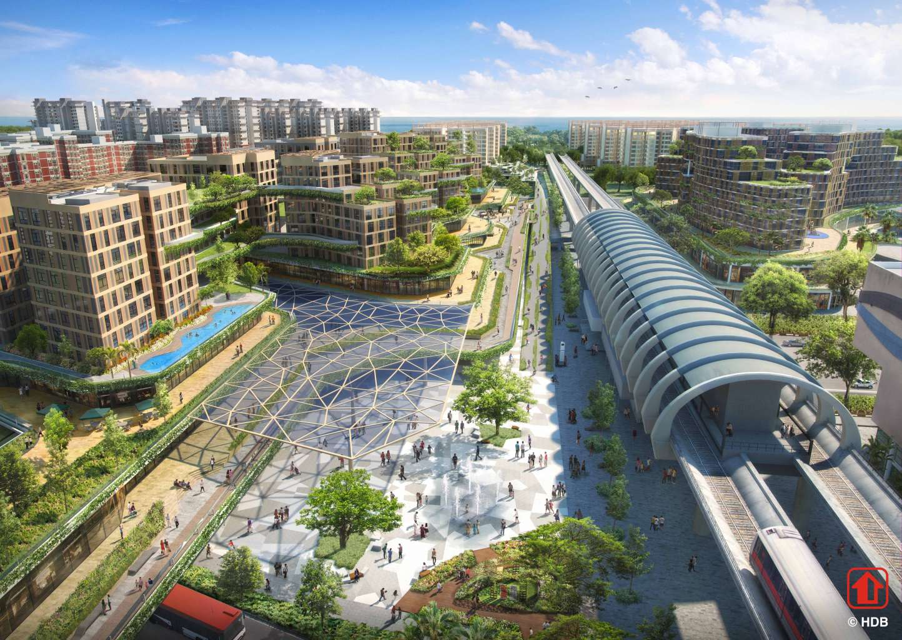

```{r libraries, include= FALSE}
library(prettydoc)
library(plyr)
library(dplyr)
library(RColorBrewer)
library(leaflet)
library(geojsonio)
library(ggplot2)
library(gganimate)
library(gifski)
library(data.table)
library(ggrepel)
library(plotly)
library(shiny)
library(rgeos)
library(zoo)
library(htmlwidgets)
library(htmltools)
library(animation)
```


```{r setup, include=FALSE}
knitr::opts_chunk$set(echo = TRUE)
knitr::opts_chunk$set(fig.align = 'center')
```


## Remaking Our Heartland Programme

<style>
body {
text-align: justify}
</style>

<style>
.html-widget {
    margin: auto;
}
</style>


```{r V1G1 Code, echo=FALSE, include=FALSE}
raw1<-read.csv("./Datasets/HDB Resale Prices.csv")

year<-substr(raw1$month, start = 1, stop = 4)
df<-as.data.frame(year)
raw<-cbind(df,raw1)

towndata<-raw%>%
  select(year,town,resale_price)

rohvalues<-which(towndata$town=="PUNGGOL"|
                   towndata$town=="YISHUN"|
                   towndata$town=="QUEENSTOWN"|
                   towndata$town=="MARINE PARADE"|
                   towndata$town=="HOUGANG"|
                   towndata$town=="JURONG EAST"|
                   towndata$town=="TOA PAYOH"|
                   towndata$town=="WOODLANDS"|
                   towndata$town=="PASIR RIS")

rohdf<-towndata[rohvalues,]
rohdf$year <- as.numeric(as.character(rohdf$year))

pgb1<-which(rohdf$town=="PUNGGOL" & rohdf$year<2007)
pgb2<-rohdf[pgb1,]
punggolbef<-mean(pgb2$resale_price)

yishunb1<-which(rohdf$town=="YISHUN" & rohdf$year<2007)
ysb2<-rohdf[yishunb1,]
yishunbef<-mean(ysb2$resale_price)

qsb1<-which(rohdf$town=="QUEENSTOWN" & rohdf$year<2007)
qsb2<-rohdf[qsb1,]
queenstownbef<-mean(qsb2$resale_price)

mpb1<-which(rohdf$town=="MARINE PARADE" & rohdf$year<2011)
mpb2<-rohdf[mpb1,]
mpbef<-mean(mpb2$resale_price)

hgb1<-which(rohdf$town=="HOUGANG" & rohdf$year<2011)
hgb2<-rohdf[hgb1,]
hgbef<-mean(hgb2$resale_price)

jeb1<-which(rohdf$town=="JURONG EAST" & rohdf$year<2011)
jeb2<-rohdf[jeb1,]
jebef<-mean(jeb2$resale_price)

tpb1<-which(rohdf$town=="TOA PAYOH" & rohdf$year<2015)
tpb2<-rohdf[tpb1,]
tpbef<-mean(tpb2$resale_price)

wb1<-which(rohdf$town=="WOODLANDS" & rohdf$year<2015)
wb2<-rohdf[wb1,]
woodbef<-mean(wb2$resale_price)

prb1<-which(rohdf$town=="PASIR RIS" & rohdf$year<2015)
prb2<-rohdf[prb1,]
prbef<-mean(prb2$resale_price)


pga1<-which(rohdf$town=="PUNGGOL" & rohdf$year>2006)
pga2<-rohdf[pga1,]
punggolaft<-mean(pga2$resale_price)

ysa1<-which(rohdf$town=="YISHUN" & rohdf$year>2006)
ysa2<-rohdf[ysa1,]
yishunaft<-mean(ysa2$resale_price)

qsa1<-which(rohdf$town=="QUEENSTOWN" & rohdf$year>2006)
qsa2<-rohdf[qsa1,]
queenstownaft<-mean(qsa2$resale_price)

mpa1<-which(rohdf$town=="MARINE PARADE" & rohdf$year>2010)
mpa2<-rohdf[mpa1,]
mpaft<-mean(mpa2$resale_price)

hga1<-which(rohdf$town=="HOUGANG" & rohdf$year>2010)
hga2<-rohdf[hga1,]
hgaft<-mean(hga2$resale_price)

jea1<-which(rohdf$town=="JURONG EAST" & rohdf$year>2010)
jea2<-rohdf[jea1,]
jeaft<-mean(jea2$resale_price)

tpa1<-which(rohdf$town=="TOA PAYOH" & rohdf$year>2014)
tpa2<-rohdf[tpa1,]
tpaft<-mean(tpa2$resale_price)

wa1<-which(rohdf$town=="WOODLANDS" & rohdf$year>2014)
wa2<-rohdf[wa1,]
woodaft<-mean(wa2$resale_price)

pra1<-which(rohdf$town=="PASIR RIS" & rohdf$year>2014)
pra2<-rohdf[pra1,]
praft<-mean(pra2$resale_price)

dpunggol<-punggolaft-punggolbef
dyishun<-yishunaft-yishunbef
dqueenstown<-queenstownaft-queenstownbef
dmarineparade<-mpaft-mpbef
dhougang<-hgaft-hgbef
djurongeast<-jeaft-jebef
dtoapayoh<-tpaft-tpbef
dwoodlands<-woodaft-woodbef
dpasirris<-praft-prbef

Punggol<-c("Punggol",punggolbef,punggolaft,dpunggol)
Yishun<-c("Yishun",yishunbef,yishunaft,dyishun)
Queenstown<-c("Queenstown",queenstownbef,queenstownaft,dqueenstown)
MarineParade<-c("Marine Parade",mpbef,mpaft,dmarineparade)
Hougang<-c("Hougang",hgbef,hgaft,dhougang)
JurongEast<-c("Jurong East",jebef,jeaft,djurongeast)
ToaPayoh<-c("Toa Payoh",tpbef,tpaft,dtoapayoh)
Woodlands<-c("Woodlands",woodbef,woodaft,dwoodlands)
PasirRis<-c("Pasir Ris",prbef,praft,dpasirris)

prices<-data.frame(Punggol,Yishun,Queenstown,MarineParade,Hougang,JurongEast,ToaPayoh,Woodlands,PasirRis)
prices<-t(prices)

colnames(prices)<-c("Town","Prices before ROH","Prices after ROH","Price Difference due to ROH")
pricesfinal<-data.frame(prices)

melted<-melt(pricesfinal,id.vars="Town",measure.vars = c("Prices.before.ROH","Prices.after.ROH"))
melted$value <- as.numeric(as.character(melted$value))

#reorder
melted$Town<-factor(melted$Town,levels=c("Marine Parade","Pasir Ris","Toa Payoh","Hougang","Punggol","Queenstown","Jurong East","Woodlands","Yishun"),ordered = TRUE)

```

```{r V1G1, echo=FALSE}

plot1<-ggplot(melted,aes(x=Town,y=value,fill=variable))+
  geom_bar(stat="identity",position='dodge')+
  ggtitle("Average Differences in Prices due to ROH")+xlab("ROH Town")+ylab("Amount")+
  theme(
    plot.title=element_text(color="black",size=12,face="bold.italic",hjust=0.5),
    axis.title.x = element_text(color="blue",size=12,face="bold"),
    axis.title.y = element_text(color="blue",size=12,face="bold")
    
  )

plot1<-plot1+scale_y_continuous(breaks=seq(150000,1000000,by=100000))

plot1final<-ggplotly(plot1)
plot1final
```
**"Remaking our Heartland"** is a program by HDB to renew and rejuvenate existing HDB towns and estates, and to ensure sustainability and vibrancy of the HDB heartlands. This generally includes building more ammenities within the neighbourhood.

This stacked bar graph shows the differences in average prices of flats that have undergone the Remaking our Heartland (ROH) program. A stacked bar chart was chosen to better show the relative difference between the prices. The graph is also sorted from highest to lowest Price after ROH.

The years used to compute Prices before ROH are from 1990 to 1 year before ROH, and the years used to compute Prices after ROH are from the year of their respective ROH commencement year to 2017.

You may hover your mouse above the bars to see the exact average price of these flats.

All flats that were improved under the ROH program have seen an increase in average resale price over the years and thus appreciated in value due to ROH. Top 3 Towns that show greatest appreciation, from most to least, are Queenstown, Marine Parade and Toa Payoh.  

```{r V1G2 Code, echo=FALSE, include=FALSE}
top1<-raw%>%
  select(year,town,resale_price)

top3a<-which(towndata$town=="QUEENSTOWN")

top3b<-top1[top3a,]


y2000w<-which(top3b$year==2000)
y2000w2<-top3b[y2000w,]
mean2000<-mean(y2000w2$resale_price)

y2001w<-which(top3b$year==2001)
y2001w2<-top3b[y2001w,]
mean2001<-mean(y2001w2$resale_price)

y2002w<-which(top3b$year==2002)
y2002w2<-top3b[y2002w,]
mean2002<-mean(y2002w2$resale_price)

y2003w<-which(top3b$year==2003)
y2003w2<-top3b[y2003w,]
mean2003<-mean(y2003w2$resale_price)

y2004w<-which(top3b$year==2004)
y2004w2<-top3b[y2004w,]
mean2004<-mean(y2004w2$resale_price)

y2005w<-which(top3b$year==2005)
y2005w2<-top3b[y2005w,]
mean2005<-mean(y2005w2$resale_price)

y2006w<-which(top3b$year==2006)
y2006w2<-top3b[y2006w,]
mean2006<-mean(y2006w2$resale_price)

y2007w<-which(top3b$year==2007)
y2007w2<-top3b[y2007w,]
mean2007<-mean(y2007w2$resale_price)

y2008w<-which(top3b$year==2008)
y2008w2<-top3b[y2008w,]
mean2008<-mean(y2008w2$resale_price)

y2009w<-which(top3b$year==2009)
y2009w2<-top3b[y2009w,]
mean2009<-mean(y2009w2$resale_price)

y2010w<-which(top3b$year==2010)
y2010w2<-top3b[y2010w,]
mean2010<-mean(y2010w2$resale_price)

y2011w<-which(top3b$year==2011)
y2011w2<-top3b[y2011w,]
mean2011<-mean(y2011w2$resale_price)

y2012w<-which(top3b$year==2012)
y2012w2<-top3b[y2012w,]
mean2012<-mean(y2012w2$resale_price)

y2013w<-which(top3b$year==2013)
y2013w2<-top3b[y2013w,]
mean2013<-mean(y2013w2$resale_price)

y2014w<-which(top3b$year==2014)
y2014w2<-top3b[y2014w,]
mean2014<-mean(y2014w2$resale_price)

y2015w<-which(top3b$year==2015)
y2015w2<-top3b[y2015w,]
mean2015<-mean(y2015w2$resale_price)

y2016w<-which(top3b$year==2016)
y2016w2<-top3b[y2016w,]
mean2016<-mean(y2016w2$resale_price)

y2017w<-which(top3b$year==2017)
y2017w2<-top3b[y2017w,]
mean2017<-mean(y2017w2$resale_price)

meantab<-c(mean2000,mean2001,mean2002,mean2003,mean2004,mean2005,
              mean2006,mean2007,mean2008,mean2009,mean2010,mean2011,
              mean2012,mean2013,mean2014,mean2015,mean2016,mean2017)

yeartab<-c("2000","2001","2002","2003","2004","2005","2006","2007",
           "2008","2009","2010","2011","2012","2013","2014","2015",
           "2016","2017")

meandf<-cbind(yeartab,meantab)
meandf2<-as.data.frame(meandf)

meandf2$meantab <- as.numeric(as.character(meandf2$meantab))
meandf2$yeartab <- as.numeric(as.character(meandf2$yeartab))

```

```{r V1G2, echo=FALSE}
options(scipen=10000)

secondplot<-ggplot(meandf2,aes(x=yeartab,y=meantab))+
  geom_line(color="red")+
  
  ggtitle("Prices in Queenstown from 2000")+xlab("Year")+ylab("Resale Amount ($)")+
  theme(
    plot.title=element_text(color="black",size=12,face="bold.italic",hjust=0.5),
    axis.title.x = element_text(color="blue",size=12,face="bold"),
    axis.title.y = element_text(color="blue",size=12,face="bold")
    
  )

plot2final<-ggplotly(secondplot)
plot2final
```
This line graph drills down to show the increase in resale prices of flats in Queenstown, which showed the greatest price increase due to ROH. 

Queenstown showed the most aggressive price increase during 2006-2008. This may be credited due to ROH-Queenstown which took place from 2007 onwards and resale prices showed an upward trend for the next 10 years till 2017.
