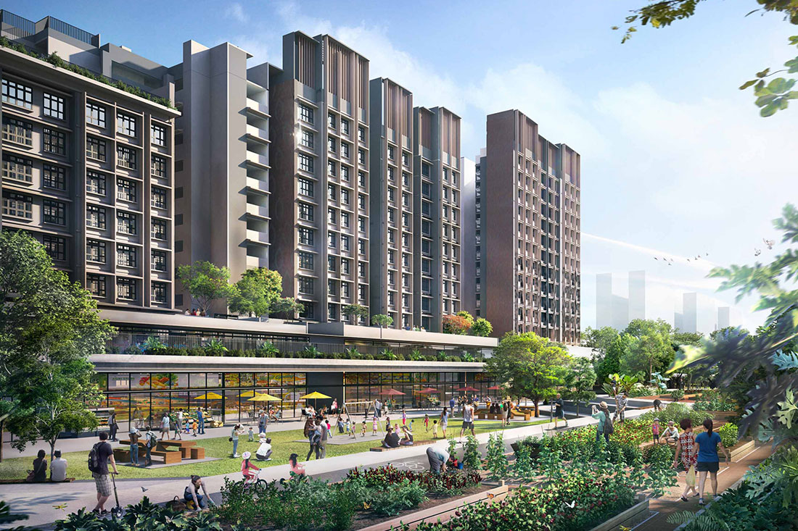

```{r libraries, include= FALSE}
library(prettydoc)
library(plyr)
library(dplyr)
library(RColorBrewer)
library(leaflet)
library(geojsonio)
library(ggplot2)
library(gganimate)
library(gifski)
library(data.table)
library(ggrepel)
library(plotly)
library(shiny)
library(rgeos)
library(zoo)
library(htmlwidgets)
library(htmltools)
library(animation)
```


```{r setup, include=FALSE}
knitr::opts_chunk$set(echo = TRUE)
knitr::opts_chunk$set(fig.align = 'center')
```

 

## Value comparison between Mature towns and Non-Mature Towns

<style>
body {
text-align: justify}
</style>

<style>
.html-widget {
    margin: auto;
}
</style>



In the Singapore market, the maturity of an estate or town refers to its age. Towns that have been around for more than 20 years are deemed mature. Those that have been built more recently are considered non-mature. The main difference between mature estate and a non mature estate two is that generally the mature-estates also have mature neighbourhoods and better amenities. Mature estate tends to be more expensive than their non-mature counterparts.


```{r V4G1 Code, echo=FALSE, include=FALSE}
maturecsv<-read.csv("./Datasets/HDB Resale Prices.csv")

mature2 <- filter(maturecsv, flat_type == "2 ROOM"|
                    flat_type == "3 ROOM" |
                    flat_type == "4 ROOM" | 
                    flat_type == "5 ROOM" | 
                    flat_type == "EXECUTIVE" | 
                    flat_type == "MULTI-GENERATION"|
                    flat_type == "MULTI GENERATION")

mature <-filter(mature2, town =="ANG MO KIO"|
                  town=="BEDOK"|
                  town=="BISHAN"|
                  town=="BUKIT MERAH"|
                  town=="BUKIT TIMAH"|
                  town=="CENTRAL AREA"|
                  town=="CLEMENTI"|
                  town=="GEYLANG"|
                  town=="KALLANG/WHAMPOA"|
                  town=="MARINE PARADE"|
                  town=="QUEENSTOWN"|
                  town=="SERANGOON"|
                  town=="TAMPINES"|
                  town=="TOA PAYOH"|
                  town=="PASIR RIS")


nonmaturecsv<-read.csv("./Datasets/HDB Resale Prices.csv")

nonmature2 <- filter(nonmaturecsv, flat_type == "2 ROOM"|
                       flat_type == "3 ROOM" |
                       flat_type == "4 ROOM" | 
                       flat_type == "5 ROOM" | 
                       flat_type == "EXECUTIVE" | 
                       flat_type == "MULTI-GENERATION"|
                       flat_type == "MULTI GENERATION")

nonmature <-filter(nonmature2, town =="BUKIT BATOK"|
                     town=="CHOA CHU KANG"|
                     town=="HOUGANG"|
                     town=="JURONG EAST"|
                     town=="JURONG WEST"|
                     town=="SENGKANG"|
                     town=="WOODLANDS"|
                     town=="YISHUN"|
                     town=="LIM CHU KANG"|
                     town=="SEMBAWANG"|
                     town=="BUKIT PANJANG"|
                     town=="PUNGGOL")
```

```{r V4G1, echo=FALSE}
k <-  plot_ly(mature, x = ~resale_price, color = ~flat_type, type = "box") %>%
  
  layout(title="Mature Town Resale Prices per Flat Type",
         xaxis=list(title="Mature Resale"),
         yaxis=list(title="Flat Type"))
k
```

The boxplot graph above depicts the resale prices of HDBs in mature towns per flat type. 5-room flats are seen to have the highest resale price over 27 years as compared to the other flat types, reaching a maximum resale price of $1.18 million followed by Executive and 3-room flat types. On the other hand, 3-room flats are seen to have the lowest resale price over 27 years, reaching a minimum of 7,500 over 27 years followed by 2-room and 4-room flat types.

```{r V4G11, echo=FALSE}
o <-  plot_ly(nonmature, x = ~resale_price, color = ~flat_type, type = "box") %>%
  
  layout(title="Non-Mature Town Resale Prices per Flat Type",
         xaxis=list(title="Non-Mature Resale"),
         yaxis=list(title="Flat Type"))
o
```

The boxplot graph above depicts the resale prices of HDBs in non-mature towns per flat type. Executive flats are seen to have the highest resale price over 27 years as compared to the other flat types, reaching a maximum resale price of $938,000 followed by 5-room and 4-room flat types. On the other hand, 2-room flats are seen to have the lowest resale price over 27 years, reaching a minimum of 16,800 over 27 years followed by 3-room and 4-room flat types.

```{r V4G2 Code, echo=FALSE, include=FALSE}
mature$month <- as.yearmon(mature$month, "%Y-%m")
str(mature)
nonmature$month <- as.yearmon(nonmature$month, "%Y-%m")

newmature <- filter(mature, month >= "2010-01")
newnonmature <- filter(nonmature, month >= "2010-01")


matureavg <- mean(newmature$resale_price)
nonmatureavg <- mean(newnonmature$resale_price)
difference <- matureavg - nonmatureavg

townavg <- c(matureavg,nonmatureavg)
townname <- c("Mature","Non-Mature")
townbar <- data.frame(townname,townavg)
```

```{r V4G2, echo=FALSE}
d <- plot_ly(townbar, x = ~townname, y = ~townavg, type = 'bar',text = townavg, textposition = 'auto') %>%
  layout(title = "Average Resale Price Difference Between Mature and Non-Mature Estate",
         xaxis = list(title = "Estate"),
         yaxis = list(title = "Average Resale Price"))

d
```
The column bar graph above depicts the difference in average resale prices overall between Mature and Non-Mature Estates over 27 years. HDB flats in mature estates are seen to be the most expensive as they are resold at an average resale price of 454873.76 while non-mature estates are seen to be cheaper as they are resold lower at 413398.32 on average.
