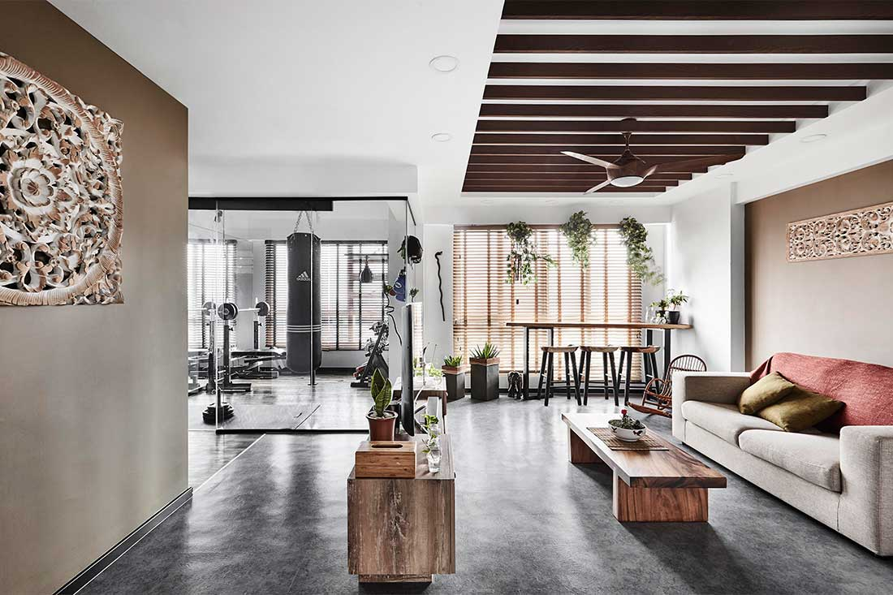

```{r libraries, include= FALSE}
library(prettydoc)
library(plyr)
library(dplyr)
library(RColorBrewer)
library(leaflet)
library(geojsonio)
library(ggplot2)
library(gganimate)
library(gifski)
library(data.table)
library(ggrepel)
library(plotly)
library(shiny)
library(rgeos)
library(zoo)
library(htmlwidgets)
library(htmltools)
library(animation)
```


```{r setup, include=FALSE}
knitr::opts_chunk$set(echo = TRUE)
knitr::opts_chunk$set(fig.align = 'center')
```

 

## How Square Meter of HDB Flats Affects Resale Price

<style>
body {
text-align: justify}
</style>

<style>
.html-widget {
    margin: auto;
}
</style>

