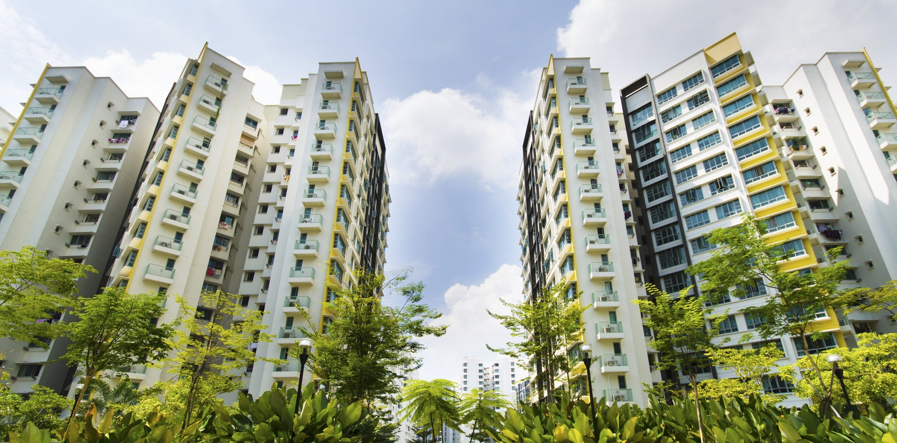

```{r libraries, include= FALSE}
library(prettydoc)
library(plyr)
library(dplyr)
library(RColorBrewer)
library(leaflet)
library(geojsonio)
library(ggplot2)
library(gganimate)
library(gifski)
library(data.table)
library(ggrepel)
library(plotly)
library(shiny)
library(rgeos)
library(zoo)
library(htmlwidgets)
library(htmltools)
library(animation)
```


```{r setup, include=FALSE}
knitr::opts_chunk$set(echo = TRUE)
knitr::opts_chunk$set(fig.align = 'center')
```

 

## Comparing Median Resale prices against other towns

<style>
body {
text-align: justify}
</style>

<style>
.html-widget {
    margin: auto;
}
</style>



According to HDB, the median prices is the fifth percentile amountof HDB resale flat purchases. This means that half of the transactions were above and below the median price. This is a useful metric to guage whether sellers/buyers overpay or underpay in their transaction and by how much. 


```{r V6G1 Code, echo=FALSE, include=FALSE}
town <- geojsonio::geojson_read("map.geojson", what = "sp")

mymap = leaflet()

tag.map.title2 <- tags$style(HTML("
  .leaflet-control.map-title { 
    transform: translate(-50%,20%);
    left: 50%;
    text-align: center;
    padding-left: 10px; 
    padding-right: 10px; 
    background: rgba(255,255,255,0.75);
    font-weight: bold;
    font-size: 28px;
  }
"))

title <- tags$div(
  tag.map.title2, HTML("Median Resale Price Per HDB Town")
)  

m <- leaflet(town) %>%
  setView(mymap, lat=1.351616, lng =103.808053, zoom = 11) %>%
  addTiles() %>%
  addControl(title, position = "topright", className="map-title")

m %>% addPolygons()

library(RColorBrewer)
factpal <- colorFactor(brewer.pal(n = 11, name ="Spectral") , town$Name)

labels <- sprintf(
  "<strong>%s</strong><br/>2017: %s<br/>2012: %s<br/>2007: %s" ,
  town$Name, town$Median2017, town$Median2012, town$Median2007
) %>% lapply(htmltools::HTML)

```

```{r V6G1, echo=FALSE}

m <- m %>% addPolygons(
  fillColor = ~factpal(town$Name),
  weight = 2,
  opacity = 1,
  color = "white",
  dashArray = "3",
  fillOpacity = 0.7,
  highlight = highlightOptions(
    weight = 5,
    color = "#666",
    dashArray = "",
    fillOpacity = 0.7,
    bringToFront = TRUE),
  label = labels,
  labelOptions = labelOptions(
    style = list("font-weight" = "normal", padding = "3px 8px"),
    textsize = "15px",
    direction = "auto"))
m
```
The map above was taken from the URA website. Different towns have been split into polygons. The median prices have been calculated to show the rough development around the area over a 5-year timespan. If an area has seen a huge increase in median resale price from one 5-year observation to another, it might imply that the area is developing and hence the median resale price increases. 

For example, if there are more "Points of Interest" in the area, the average resale price of the area will go up, which means that the median resale price will increase as well. 

Where polygons that shows $0 for all three observations are those that either have no resale data or are not HDB towns.  

***

Reference:

* Map: https://data.gov.sg/dataset/master-plan-2014-planning-area-boundary-no-sea
* Data: https://data.gov.sg/dataset/resale-flat-prices

